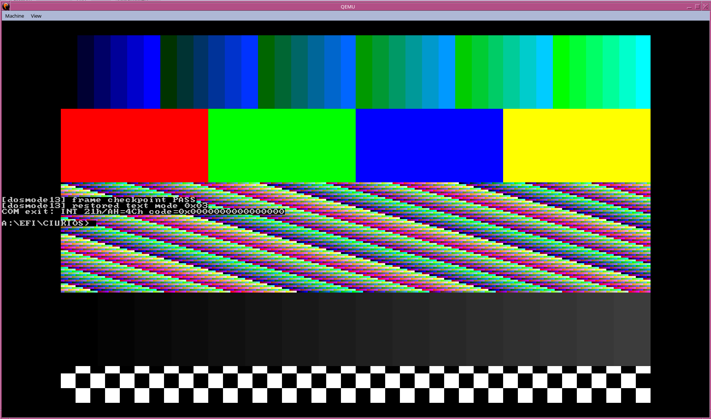
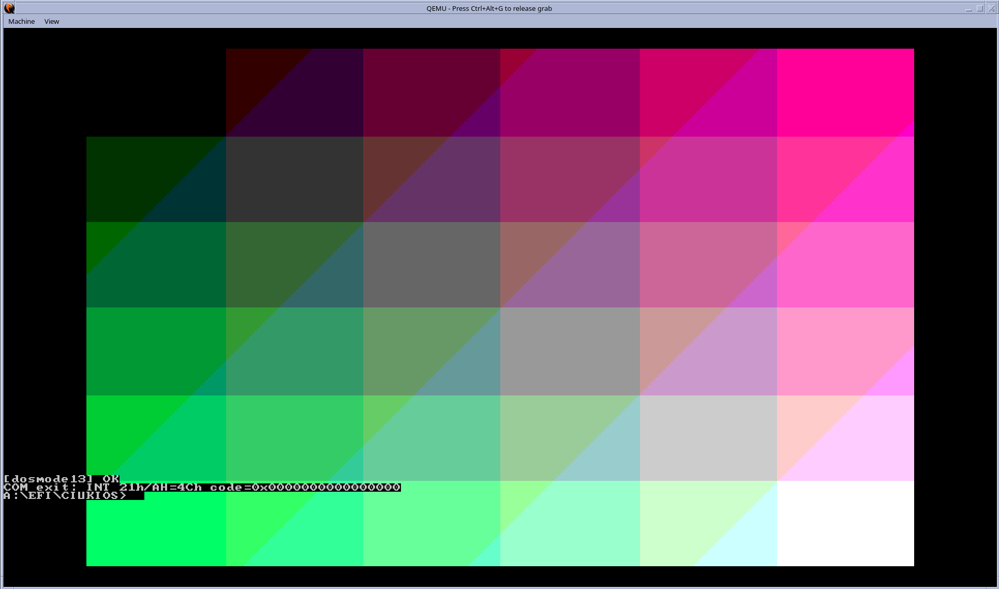

# Changelog

All notable changes to CiukiOS are tracked here.

## Unreleased

## v0.8.6
1. Promoted the recent shell UX wave into the released baseline: direct execution by bare name and path-aware targets, richer `which` / `where` / `resolve` introspection, and deterministic resolver markers/selftests.
2. Expanded the DOS-like line editor with inline cursor movement plus higher-value shortcuts (`Esc`, `Ctrl+A`, `Ctrl+E`, `Ctrl+U`, `Ctrl+K`, `Ctrl+L`) while preserving the existing command flow and history behavior.
3. Strengthened shell tab completion for builtins, runnable programs, and FAT current-directory entries, including common-prefix expansion, ambiguous-match listing, and directory-prefixed continuation semantics.
4. Upgraded the VGA mode `0x13` path from a compatibility scaffold to a first real runtime checkpoint with explicit mode-set and present markers in the graphics path.
5. Reworked `DOSMODE13.COM` into a deterministic multi-region frame sample that enters mode `0x13`, renders a richer validation frame, restores text mode cleanly, and now has a real QEMU screenshot reference.
6. Replaced the old static-only VGA baseline gate with a stronger runtime-aware `test-vga13-baseline` flow that attempts marker-driven QEMU validation and falls back to static checks only when host capture is incomplete.
7. Extended the M6 DPMI smoke chain with a new stateful free-memory slice: `CIUKREL.EXE` validates `INT 31h AX=0502h` after a real `AX=0501h` allocation, including duplicate-free rejection.
8. Upgraded the synthetic DPMI memory allocator from one-shot shape-only success to tracked handle ownership so allocation/free semantics are now meaningful to smoke binaries.
9. Wired the new M6 free-memory smoke into `Makefile`, image packaging, the aggregate DOOM-readiness gate, and supporting roadmap/documentation files.
10. Bumped baseline to `CiukiOS Alpha v0.8.6`.

## v0.8.5
1. Added `gfx_mode13_blit_indexed_clip(src, sw, sh, stride, dx, dy, use_transparent, transparent_idx)` for signed/clipped indexed patch blits and `gfx_mode13_blit_scaled_clip(...)` for signed/clipped nearest-neighbor scaled blits.
2. Added `gfx_mode13_draw_column_sampled_masked(x, y, h, src, src_h, frac_16_16, frac_step_16_16, transparent_idx)` for DOOM-style sampled masked columns with 16.16 stepping.
3. Extended `ciuki_gfx_services_t` with `mode13_blit_indexed_clip`, `mode13_blit_scaled_clip`, and `mode13_draw_column_sampled_masked`.
4. Updated `GFXDOOM.COM` to validate clipped patch placement and sampled stretched columns, making the demo materially closer to real sprite/patch rendering paths.
5. Bumped baseline to `CiukiOS Alpha v0.8.5`.

## v0.8.4
1. Added `gfx_mode13_blit_scaled(src, sw, sh, stride, dx, dy, dw, dh, use_transparent, transparent_idx)` for nearest-neighbor scaled indexed blits on the mode 0x13 plane.
2. Added `gfx_mode13_draw_column_masked(x, y, h, src, transparent_idx)` for transparent single-column draws and `gfx_frame_counter()` to count successful presents.
3. Extended `ciuki_gfx_services_t` with `mode13_blit_scaled`, `mode13_draw_column_masked`, and `frame_counter` (append-only ABI growth).
4. Added `GFXDOOM.COM` as a DOOM-style validation demo and wired it into `Makefile` + `run_ciukios.sh`.
5. Bumped baseline to `CiukiOS Alpha v0.8.4`.

## v0.8.3
1. DOS universality expansion on the video ABI: `gfx_mode13_blit_indexed(src, sw, sh, stride, dx, dy, use_transparent, transparent_idx)` 8-bit masked/opaque bitmap blit, `gfx_mode13_draw_column(x, y, h, src)` single-column fast path (DOOM R_DrawColumn-style), `gfx_palette_get_raw(first, count, out6bit)` palette read-back.
2. `gfx_int10_dispatch` extended with AH=01/02/03/06/07/08/09/0A/0B/0E/11/12/1A (cursor shape/set/get, scroll, read char, write char×CX with and without attr, teletype, get DCC, stub-accepts for character generator / alternate select).
3. Added `video_get_cursor(*col, *row)` to back AH=03h with the live console cursor.
4. Extended `ciuki_gfx_services_t` with `mode13_blit_indexed`, `mode13_draw_column`, `palette_get_raw` (append-only before `reserved[32]`). Backwards-compatible.
5. Bumped baseline to `CiukiOS Alpha v0.8.3`.

## v0.8.2
1. DOOM-prep palette + fill primitives: `gfx_palette_fade(target_rgb, step, total)` (captured-baseline linear blend of the full 256-entry palette toward a 24-bit target color — blood flashes, intermissions, title wipes), `gfx_mode13_fill(color)` and `gfx_mode13_fill_rect(x,y,w,h,color)`.
2. Extended `ciuki_gfx_services_t` with `palette_fade`, `mode13_fill`, `mode13_fill_rect` (append-only before the `reserved[32]` tail). Wired in stage2 shell.
3. New `FADEDMO.COM` sample (`com/fadedemo/`): mode 0x13 + 10 concentric color-cube bands + fade-to-red + fade-to-black + `[fadedmo] OK`.
4. External palette mutations now invalidate the fade baseline for fresh re-capture.
5. Bumped baseline to `CiukiOS Alpha v0.8.2`.

## v0.8.1
1. Completed SR-VIDEO-002 milestones M-V2.4 and M-V2.5 (DOS/VGA mode compatibility + palette + cached present).
2. M-V2.4: new `stage2/src/gfx_modes.c` + `stage2/include/gfx_modes.h`. Mode 0x13 (320×200×8) planar surface upscaled (nearest-neighbor, integer scale up to 6×) and letterboxed into the 32bpp GOP backbuffer. `gfx_int10_dispatch` implements BIOS INT 10h AH=00h/0Ch/0Dh/0Fh and VBE AH=4Fh AL=00/01/02/03 with VBE mode IDs 0x0013 / 0x0100 / 0x0101 / 0x0003 mapped onto the internal planes. New shell command `mode` (`info`, `set <hex>`, `test13`, `text`).
3. M-V2.5: 256-entry palette (VGA-compatible default: CGA/EGA 16 + greyscale ramp + 6×6×6 color cube). `gfx_palette_set(first,count,rgb6bit)` exposed via services. Present path skips the upscale pass when neither plane nor palette changed since the last commit (cached present / 60 fps cap baseline).
4. Extended `ciuki_gfx_services_t` (`boot/proto/services.h`) with `set_mode` / `get_mode` / `present` / `set_palette` / `mode13_plane` / `mode13_put_pixel` / `int10`; wired in stage2. New sample `DOSMD13.COM` (`com/dosmode13/`) sets mode 0x13, fills a gradient via the ABI, tweaks one palette entry, calls `present()`, and emits `[dosmode13] OK`.
5. `gfx_mode_init()` called right after `video_init()` so mode/palette state is live before any COM runs.
6. Bumped baseline to `CiukiOS Alpha v0.8.1`.

## v0.8.0
1. Completed SR-VIDEO-002 milestones M-V2.0..M-V2.3 (flicker-free video baseline, 2D rasterizer, BMP decoder, stable 2D graphics services ABI).
2. M-V2.0: `video_begin_frame` / `video_end_frame` frame-scope compositor plus non-temporal `mem_copy_nt` (x86-64 `movnti` + `sfence`) present path; splash / HUD / title bar / desktop / shell input migrated to atomic frame commits.
3. M-V2.1: `stage2/src/gfx2d.c` + `stage2/include/gfx2d.h` — pixel, hline/vline, Bresenham line, rect outline/fill, midpoint circle outline/fill, flat-top/flat-bottom triangle fill, raw blit, masked blit, clipping. New shell command `gfx test-pattern` / `gfx info`.
4. M-V2.2: `stage2/src/image.c` + `stage2/include/image.h` — BMP decoder (BI_RGB 24/32bpp top-down + bottom-up, ≤1920×1080). New shell command `image show <path>`.
5. M-V2.3: extended `boot/proto/services.h` with `ciuki_gfx_services_t`; populated in shell.c. New `GFXSMK.COM` (`com/gfxsmoke/`) exercises the ABI and emits `[gfxsmoke] OK`.
6. Bumped baseline to `CiukiOS Alpha v0.8.0`.

## v0.7.1
1. Extended the M6 DPMI smoke chain with a new allocate-memory-block callable slice (`CIUKMEM.EXE` -> `0x54`) exercising `INT 31h AX=0501h` and returning a synthetic linear address + memory handle; validated by the new gate `make test-m6-dpmi-mem-smoke`.
2. Added `[compat] bios int2f baseline ready` startup marker so `INT 2Fh` multiplex readiness (already used by DPMI detect) has an explicit greppable signal alongside the `INT 10h/16h/1Ah` markers.
3. Integrated the new gate into the aggregate M6 readiness orchestration (`scripts/test_doom_readiness_m6.sh`) and restored the correct dependency graph for `freecom-sync` (accidentally pinned to the v0.7.0 DOOM gates).
4. Added the missing DPMI-LDT / VGA13 / DOOM-boot-harness / DPMI-memory targets to the `Makefile` `.PHONY` list for cleaner `make` dispatch.

## v0.7.0
1. Advanced the M6 DPMI smoke chain with a new allocate-LDT-descriptors callable slice (`CIUKLDT.EXE` -> `0x52`) exercising `INT 31h AX=0000h` after the existing host + version + bootstrap baseline, validated by the new gate `make test-m6-dpmi-ldt-smoke`.
2. Introduced the first VGA mode 13h compatibility scaffold: new `vga13` shell command, deterministic startup marker `[compat] vga13 baseline ready (320x200x8 scaffold)`, and new gate `make test-vga13-baseline`.
3. Added BIOS compatibility surface markers for `INT 10h`, `INT 16h`, and `INT 1Ah` so DOOM-path startup dependencies have explicit, greppable readiness signals.
4. Added a staged boot-to-DOOM failure-taxonomy harness (`make test-doom-boot-harness`) that classifies progress into `binary_found`, `wad_found`, `extender_init`, `video_init`, and `menu_reached` (last stage deferred until real DOOM runtime is wired).
5. Integrated the four new gates into the aggregate M6 readiness orchestration (`scripts/test_doom_readiness_m6.sh`).

## v0.6.9
1. Added deterministic startup-chain gate `make test-startup-chain`, covering `CONFIG.SYS`, `AUTOEXEC.BAT`, `.BAT` labels/`goto`/`if errorlevel`, env expansion and FreeDOS startup-file image wiring.
2. Added FAT32 edge-semantics gate `make test-fat32-edge`, covering FSInfo corruption fallback, hint sanitization, alloc/free sync and fixed-root overflow guards.
3. Strengthened GUI and OpenGEM regression coverage so layout/discoverability contracts and OpenGEM preflight/launch wiring are validated explicitly instead of relying on documentation drift.
4. Closed the remaining roadmap items that were still marked `IN PROGRESS` for the current UI/FAT/startup baseline and synchronized roadmap docs to the validated implementation state.

## v0.6.8
1. Added the first DOS/4GW-like smoke executable `CIUK4GW.EXE`, included in the OS image and returning deterministic code `0x47` after a minimal DPMI host query.
2. Extended the services ABI and stage2 DOS runtime with a minimal callable `INT 2Fh AX=1687h` host-query slice for DOS extender smoke validation.
3. Added dedicated gate `make test-m6-dos4gw-smoke` and wired it into the aggregate M6 readiness orchestration.
4. M6 now validates both a generic protected-mode readiness smoke (`CIUKPM.EXE`) and a first DOS/4GW-like host-query smoke (`CIUK4GW.EXE`).

## v0.6.7
1. Closed SR-M6-001 readiness baseline with a reproducible smoke executable `CIUKPM.EXE` included in the OS image and returning deterministic code `0x36`.
2. Added dedicated gate `make test-m6-smoke` to validate M6 smoke-program wiring and runtime launch markers.
3. Restored static-fallback validation in `make test-m6-pmode` and `make test-m6-transition-v2` for hosts where QEMU serial capture is unavailable.
4. Updated aggregate M6 readiness gate so FreeDOS pipeline drift is non-blocking for the protected-mode readiness baseline while core M6 gates remain blocking.

## v0.6.6
1. Closed SR-DOSRUN-001 with deterministic `.EXE MZ` single-program smoke path (`CIUKMZ.EXE` -> `0x2B`) reproducible from source via `tools/mkciukmz_exe`.
2. Added dedicated MZ gate `make test-dosrun-mz` (`scripts/test_dosrun_mz_simple.sh`) validating `[dosrun] launch path=CIUKMZ.EXE type=MZ` + success return marker.
3. Added DOS command-tail / argv bridge markers (`[dosrun] argv tail len=...`, `[dosrun] argv parse=PASS|FAIL`) and extended run-path error classes (`unsupported_int21`, `args_parse`).
4. Extended INT21h coverage with deterministic date/time (`AH=2Ah`, `AH=2Ch`) and IOCTL get-device-info (`AH=44h`/`AL=00h`) plus boot-time `[compat]` markers.
5. Expanded compatibility matrix gate (`make check-int21-matrix`) with 2Ah/2Ch/44h rows in `docs/int21-priority-a.md`.

## v0.6.5
1. Closed M6 baseline contract with deterministic protected-mode transition markers (`transition state`, `GDT/IDT snapshot`, `CR0`, `return-path`).
2. Added M6 baseline entry infrastructure markers (`A20 probe/enable`, descriptor baseline) and DOS extender host-interface skeleton markers.
3. Added pmode memory-domain overlap guard markers and integrated transition-v2 gate (`make test-m6-transition-v2`) into M6 readiness orchestration.
4. Updated protected-mode requirements/contract docs for v2 baseline scope and current residual gap (real DOS/4GW compatibility beyond skeleton).

## v0.6.4
1. Replaced simple first-fit GOP mode selection with deterministic scoring engine (resolution class, aspect ratio, memory budget) supporting 1024x768 through 3840x2160.
2. Added explicit budget tiers by resolution class with safe double-buffer ceiling and deterministic fallback degrade policy.
3. Added wide-mode compatibility matrix gate `make test-video-policy-matrix` validating policyv2/budgetv2 markers across loader and stage2.
4. Hardened desktop/UI layout engine for wide resolutions (1024x768, 1280x800, 1920x1080, 2560x1440) with clipping validation markers.
5. Closed Phase 1 video scaling/policy roadmap item.

## v0.6.3
1. Expanded video subsystem with overlay plane support, frame pacing counters, and deterministic present-mode telemetry.
2. Added layout metrics v3 and adaptive font profiles (`small`/`normal`) to improve UI readability across multiple resolutions.
3. Added video/UI regression gate `make test-video-ui-v2` (`scripts/test_video_ui_regression_v2.sh`).
4. Added deterministic DOS smoke payload `CIUKSMK.COM` and integrated `run` outcome markers (`ok/not_found/bad_format/runtime`).
5. Added end-to-end DOS run gate `make test-dosrun-simple` (`scripts/test_dosrun_simple_program.sh`) validating launch + return code path.
6. Fixed DOS run selftest contract to validate runtime-native `AH=4Ch -> AH=4Dh` one-shot status semantics.
7. Added CMOS-backed persistent boot video configuration with integrity checks and loader source precedence (`CMOS` -> `VMODE.CFG` -> policy), including reboot persistence gate `make test-vmode-persistence`.

## v0.6.2
1. Improved FAT layer toward FAT32 baseline with mount metadata marker (`type/fsinfo/next_free_hint`) in stage2 boot logs.
2. Added hint-based free-cluster allocation strategy (`next_free_hint`) instead of fixed scan from cluster 2.
3. Added dynamic directory-chain expansion for non-fixed directories (important for FAT32 root/subdirectory growth).
4. Added regression gate `make test-fat32-progress` (`scripts/test_fat32_progress.sh`).
5. Expanded main roadmap with new sub-roadmaps: `SR-DOSRUN-001` (simple DOS program milestone) and `SR-FS-002` (FAT32 capability track).

## v0.6.1
1. Added M6 protected-mode contract baseline selftests at startup with explicit PASS/FAIL markers.
2. Added dedicated gate `make test-m6-pmode` (`scripts/test_m6_pmode_contract.sh`).
3. Added M6 requirements document: `docs/m6-dos-extender-requirements.md`.
4. Added aggregate M6 readiness gate: `scripts/test_doom_readiness_m6.sh` (phase2 + freedos + video + m6 gates).
5. Refreshed `third_party/freedos/runtime-manifest.csv` to restore reproducibility checks in pipeline validation.
6. Updated roadmap and sub-roadmaps to reflect M6 activation and current video/backbuffer status.

## v0.6.0
1. Merged INT21 compatibility expansion with `AH=56h` rename (same-directory DOS-like subset).
2. Extended INT21 FAT end-to-end selftest coverage to include rename path validation.
3. Synced INT21 compatibility matrix and matrix gate with function `56h`.
4. Integrated video mode stack: GOP mode catalog handoff, `VMODE.CFG` persistence, and shell command surface `vmode`/`vres`.
5. Added dedicated regression gate `make test-video-mode` and hardened execution with QEMU lock serialization.
6. Updated stage2 runtime version string to match current alpha.
7. Improved EXE/MZ runtime compatibility and strengthened deterministic regression coverage.

## v0.5.5
1. Integrated the first minimal video driver pass with double buffering and explicit `video_present()` flow.
2. Added scanline blitting path for splash rendering to reduce per-pixel overhead.
3. Added GOP mode selection hardening in loader (preferred mode order + `QueryMode` cleanup).
4. Added central roadmap file with main milestones and sub-roadmap tracking.
5. Synced stage2 runtime version string with README version.

## v0.5.4
1. Added optional OpenGEM (FreeGEM) integration flow (`import`, runtime composition, pipeline gate, smoke test, image probe).
2. Added shell `opengem` command with preflight checks and multi-entry launch path detection.
3. Added OpenGEM provenance, ops and licensing notes in project docs.
4. Kept FreeDOS pipeline compatibility and automated validation green.

## v0.5.2
1. Updated project purpose and public positioning as Open Source RetroOS.
2. Added collaboration and contribution direction in README.
3. Added explicit development pace note (spare-time project).
4. Added donation/support section and dedicated donation file.
5. Moved internal LLM collaboration/handoff docs to local-only workflow.
6. Introduced pre-1.0 alpha policy for releases and build instructions.

## v0.5.1
1. Improved desktop readability with layout grid v2 and clearer window chrome.
2. Upgraded desktop interaction flow (focus/navigation feedback and launcher clarity).
3. Added launcher/dock visual pass v2 with better selection visibility.
4. Added GUI regression helper script: `make test-gui-desktop`.
5. Added Copilot handoffs for desktop polish tasks D1-D5.

## v0.5
1. Added INT21 compatibility set for console/drive/DTA paths (`AH=06h/07h/0Ah/0Eh/1Ah/2Fh`) with deterministic tests.
2. Extended boot/test gates for INT21 matrix and compatibility markers.
3. Added interactive desktop session from shell (`desktop` command).
4. Added desktop controls (`TAB`, `UP/DOWN`, `J/K`, `ENTER`, `ESC`) and startup hint for GUI testing.
5. Kept boot/fallback/FAT/INT21 automated regression flow green.

## v0.4
1. Added graphic splash renderer (framebuffer, centered scaling, ASCII-to-grayscale mapping).
2. Added explicit framebuffer metadata in stage handoff ABI.
3. Added shell preview command: `gsplash` (alias `splash`).
4. Kept ASCII splash as automatic fallback path.