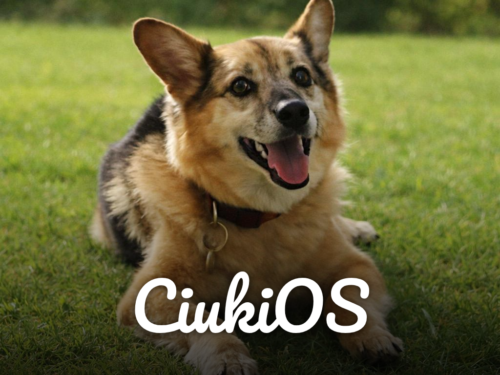

# CiukiOS

Open Source RetroOS project built from scratch.
Mission: become a progressively more complete environment capable of running DOS, FreeDOS and pre-NT Windows software over time.

## Current Version
`CiukiOS Alpha v0.8.1`
Focus: compatibility foundation + progressive desktop/runtime improvements.

## Index
1. Full documentation: [documentation.md](documentation.md)
2. Full changelog: [CHANGELOG.md](CHANGELOG.md)
3. High-level roadmap: [Roadmap.md](Roadmap.md)
4. Detailed DOOM roadmap: [docs/roadmap-ciukios-doom.md](docs/roadmap-ciukios-doom.md)
5. Donations and support: [DONATIONS.md](DONATIONS.md)

## Changelog (Latest)
### v0.8.1
1. Completed subroadmap **SR-VIDEO-002** milestones M-V2.4 and M-V2.5 — DOS / VGA mode compatibility surface and palette / present-cache layer on top of the flicker-free baseline shipped in v0.8.0.
2. M-V2.4 (INT 10h + VGA mode 0x13 emulation): new `stage2/src/gfx_modes.c` + `stage2/include/gfx_modes.h`. Mode 0x13 keeps a 320×200×8 planar surface that is nearest-neighbor-upscaled (integer scale up to 6×) and letterboxed into the real 32bpp GOP backbuffer on `gfx_mode_present`. `gfx_int10_dispatch` routes BIOS INT 10h sub-functions AH=00h (set mode 0x03 / 0x13), AH=0Ch (write pixel), AH=0Dh (read pixel), AH=0Fh (get mode), AH=4Fh VBE AL=00/01/02/03 (info / mode info / set mode / get mode) with VBE mode IDs 0x0013 / 0x0100 / 0x0101 / 0x0003 mapped onto the internal planes. New shell command `mode` (`mode info`, `mode set <hex>`, `mode test13`, `mode text`).
3. M-V2.5 (palette + present cache): 256-entry palette initialized with a VGA-compatible default (CGA/EGA 16 + greyscale ramp + 6×6×6 color cube); `gfx_palette_set(first,count,rgb6bit)` exposed via services. Present path marks plane and palette dirty flags and skips the full upscale pass when neither changed since the last commit (M-V2.5 cached present + trivial 60 fps cap).
4. Extended `ciuki_gfx_services_t` (`boot/proto/services.h`) with `set_mode`, `get_mode`, `present`, `set_palette`, `mode13_plane`, `mode13_put_pixel`, `int10`. Wired all of them into the stage2 services table. New sample `DOSMD13.COM` (com/dosmode13/) sets mode 0x13, writes a palette-indexed gradient via the ABI, tweaks one palette entry, commits via `present()`, and emits `[dosmode13] OK` on serial.
5. `gfx_mode_init()` called right after `video_init()` so the plane and default palette are live before any COM runs.
6. Bumped baseline version to `CiukiOS Alpha v0.8.1`.

### v0.8.0
1. Completed subroadmap **SR-VIDEO-002** milestones M-V2.0..M-V2.3 — flicker-free video baseline, 2D rasterizer, BMP decoder and stable 2D graphics services ABI for COM programs.
2. M-V2.0 (video compositor hardening): introduced frame-scope depth counter (`video_begin_frame` / `video_end_frame`) so nested `video_write` / `video_putchar('\n')` no longer trigger multi-commit tearing; added `mem_copy_nt` (x86-64 `movnti` + `sfence`) non-temporal framebuffer store path used by full-frame and per-row present; wrapped splash, HUD, title bar, desktop session and shell input paths so every UI scene commits atomically.
3. M-V2.1 (2D software rasterizer): new `stage2/src/gfx2d.c` + `stage2/include/gfx2d.h` with clipping state, pixel / hline / vline / Bresenham line / rect (outline + filled) / midpoint circle (outline + filled) / top-flat + bottom-flat filled triangle / raw-blit / color-key masked blit. Each primitive marks a single dirty rect and clips to framebuffer + active clip. New shell command `gfx test-pattern` draws a visual regression pattern and emits `[gfx] test pattern v1 OK` on serial; `gfx info` prints fb size.
4. M-V2.2 (BMP image pipeline): new `stage2/src/image.c` + `stage2/include/image.h` decoding Windows BMP BITMAPINFOHEADER BI_RGB at 24bpp and 32bpp, top-down and bottom-up, into a 32bpp `0x00RRGGBB` scratch buffer (max 1920×1080). New shell command `image show <path>` reads the file via FAT and centers it on-screen using `gfx2d_blit`.
5. M-V2.3 (stable graphics ABI for COM programs): extended `boot/proto/services.h` with `ciuki_gfx_services_t` (begin/end frame, put_pixel, fill_rect, rect, line, circle, fill_circle, fill_tri, blit, get_fb_info) and added `const ciuki_gfx_services_t *gfx` to `ciuki_services_t`. Populated in stage2 shell. New `GFXSMK.COM` (com/gfxsmoke/) exercises the full ABI from a loaded COM binary, emits `[gfxsmoke] OK`, returns via `INT 21h AH=4Ch`.
6. Bumped baseline version to `CiukiOS Alpha v0.8.0`.

### v0.7.1
1. Extended the M6 DPMI smoke chain with a new allocate-memory-block callable slice (`CIUKMEM.EXE` -> `0x54`) exercising `INT 31h AX=0501h` and returning a synthetic linear address + memory handle; validated by the new gate `make test-m6-dpmi-mem-smoke`.
2. Added `[compat] bios int2f baseline ready` startup marker so `INT 2Fh` multiplex readiness (already used by DPMI detect) has an explicit greppable signal alongside the `INT 10h/16h/1Ah` markers.
3. Integrated the new gate into the aggregate M6 readiness orchestration (`scripts/test_doom_readiness_m6.sh`) and restored the correct dependency graph for `freecom-sync` (accidentally pinned to the v0.7.0 DOOM gates).
4. Added the missing DPMI-LDT / VGA13 / DOOM-boot-harness / DPMI-memory targets to the `Makefile` `.PHONY` list for cleaner `make` dispatch.

### v0.7.0
1. Advanced the M6 DPMI smoke chain with a new allocate-LDT-descriptors callable slice (`CIUKLDT.EXE` -> `0x52`) exercising `INT 31h AX=0000h` after the existing host + version + bootstrap baseline, validated by the new gate `make test-m6-dpmi-ldt-smoke`.
2. Introduced the first VGA mode 13h compatibility scaffold: new `vga13` shell command, deterministic startup marker `[compat] vga13 baseline ready (320x200x8 scaffold)`, and new gate `make test-vga13-baseline`.
3. Added BIOS compatibility surface markers for `INT 10h`, `INT 16h`, and `INT 1Ah` so DOOM-path startup dependencies have explicit, greppable readiness signals.
4. Added a staged boot-to-DOOM failure-taxonomy harness (`make test-doom-boot-harness`) that classifies progress into `binary_found`, `wad_found`, `extender_init`, `video_init`, and `menu_reached` (last stage deferred until real DOOM runtime is wired).
5. Integrated the four new gates into the aggregate M6 readiness orchestration (`scripts/test_doom_readiness_m6.sh`).

### v0.6.9
1. Added deterministic startup-chain gate `make test-startup-chain`, covering `CONFIG.SYS`, `AUTOEXEC.BAT`, `.BAT` labels/`goto`/`if errorlevel`, env expansion and FreeDOS startup-file image wiring.
2. Added FAT32 edge-semantics gate `make test-fat32-edge`, covering FSInfo corruption fallback, hint sanitization, alloc/free sync and fixed-root overflow guards.
3. Strengthened GUI and OpenGEM regression coverage so layout/discoverability contracts and OpenGEM preflight/launch wiring are validated explicitly instead of relying on documentation drift.
4. Closed the remaining roadmap items that were still marked `IN PROGRESS` for the current UI/FAT/startup baseline and synchronized roadmap docs to the validated implementation state.

Full changelog: [CHANGELOG.md](CHANGELOG.md)

## Current Direction
The active north star is:
1. Run real DOS executables on CiukiOS.
2. Reach the first major game milestone: run DOS DOOM from CiukiOS.
3. Extend compatibility toward DOS, FreeDOS and pre-NT Windows software in incremental phases.

## Open Source Collaboration
CiukiOS is open to collaborative proposals, issue reports, technical discussion and PR contributions.
If you want to help, please open an issue with:
1. clear problem/idea description
2. expected behavior
3. reproducible steps or technical context

## Development Pace
This is a spare-time project.
Updates are continuous but not on a fixed schedule: progress depends on available free time and mood.

## Alpha Policy (Pre-1.0)
Until `CiukiOS Alpha v1.0`, this project follows these rules:
1. No official prebuilt release artifacts are provided.
2. No public step-by-step build instructions are provided in this README.
3. Development is currently heavily assisted by LLM tooling (OpenAI, Claude, Copilot) while core engineering skills and architecture mature.
4. Versioning cadence: every 2/3 integrated updates bump patch version automatically (`x.y.z -> x.y.(z+1)`); milestone-sized integrations may bump minor version.

## Key Docs
1. Central project documentation: [documentation.md](documentation.md)
2. Full changelog: [CHANGELOG.md](CHANGELOG.md)
3. Unified roadmap and sub-roadmaps: [Roadmap.md](Roadmap.md)
4. DOS-to-DOOM roadmap: [docs/roadmap-ciukios-doom.md](docs/roadmap-ciukios-doom.md)
5. DOS 6.2 compatibility roadmap: [docs/roadmap-dos62-compat.md](docs/roadmap-dos62-compat.md)
6. FreeDOS integration and licensing policy: [docs/freedos-integration-policy.md](docs/freedos-integration-policy.md)
7. FreeDOS symbiotic architecture: [docs/freedos-symbiotic-architecture.md](docs/freedos-symbiotic-architecture.md)
8. OpenGEM integration notes and operations: [docs/opengem-integration-notes.md](docs/opengem-integration-notes.md), [docs/opengem-ops.md](docs/opengem-ops.md)
9. Shared contributor/session notes: [CLAUDE.md](CLAUDE.md)

## Third-Party and Licensing (FreeDOS + OpenGEM Notice)
1. This repository can include and use third-party FreeDOS components in `third_party/freedos/`.
2. FreeDOS packages are distributed under their own licenses (often GPL-family, but not a single license for all files).
3. OpenGEM is integrated as an optional GUI payload in the FreeDOS runtime path (`third_party/freedos/runtime/OPENGEM/`), licensed under GPL-2.0-or-later.
4. Keep license/provenance files with imported components and validate redistribution rights per package.
5. See:
   - `docs/freedos-integration-policy.md`
   - `docs/opengem-integration-notes.md`
   - `docs/opengem-ops.md`
   - `docs/legal/freedos-licenses/`

## Donations and Support
If you want to support CiukiOS development (including recurring LLM/tooling costs such as OpenAI, Claude and Copilot subscriptions), see:
- [DONATIONS.md](DONATIONS.md)

Provider selection is currently in progress to choose the most convenient and transparent option for contributors.

## Credits
Developed collaboratively with Claude Code,Codex(Openai) and Github Copilot.

The name **CiukiOS** comes from a private joke between me and my girlfriend about our dog Jack (Jacky), who is no longer with us.
His nickname was **Ciuk/Ciuki**, and we used to joke that if we ever built an operating system, we would call it **CiukiOS**.

So this is why is dedicated to one of the best dogs i ever met, Jack.
