# CiukiOS

**A modern Retro OS · pre-Alpha 0.8.0**

CiukiOS is a DOS-based x86 operating system with its own CiukiDOS kernel and graphical desktop. It is dedicated to **Ciuk**, the dog in the [boot splash](misc/CiukiOS_SplashScreen.png). The system icons use [Tango](assets/icons/README.md); CiukiOS identity icons use the owner's [approved portrait](assets/brand/ciuki-logo.png).

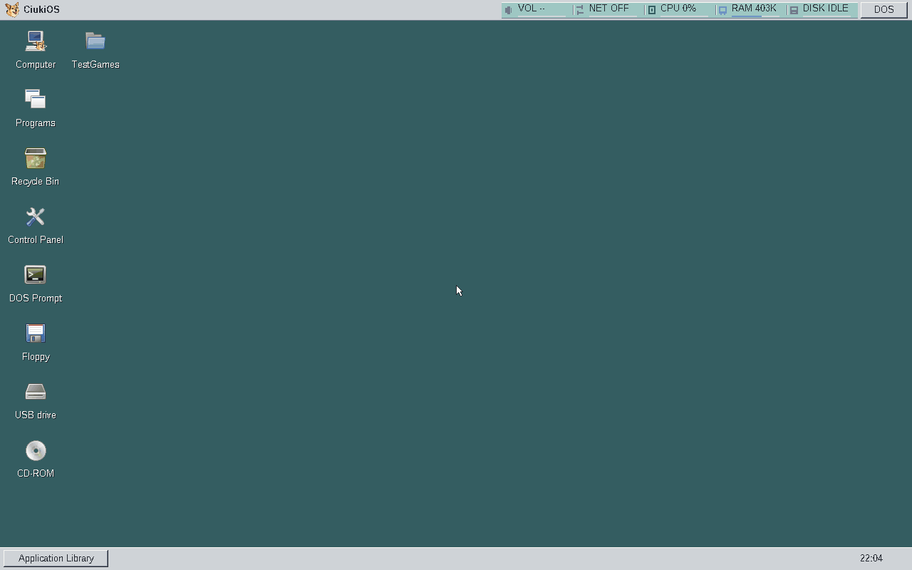

*The 0.8.0 desktop in QEMU. Click the CiukiOS portrait for the system menu; the right side shows sound, network, CPU, memory and disk activity.*

[Explore the screenshots](#explore-080) · [What works](#what-works) · [Run it](#run-it) · [What's next](#whats-next) · [Current status](docs/project-status-2026-10-01.md)

## Explore 0.8.0

These are unedited QEMU captures from development builds. [Capture provenance](docs/screenshots/0.8.0/README.md) identifies each run; they are not physical-PC evidence.

### Desktop and applications

| Files and long names | CiukPaint drawing live |
| --- | --- |
| 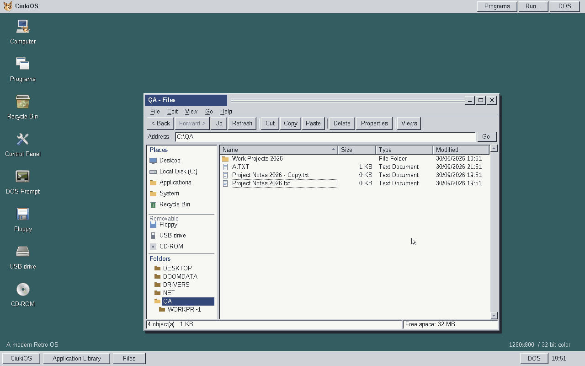 | 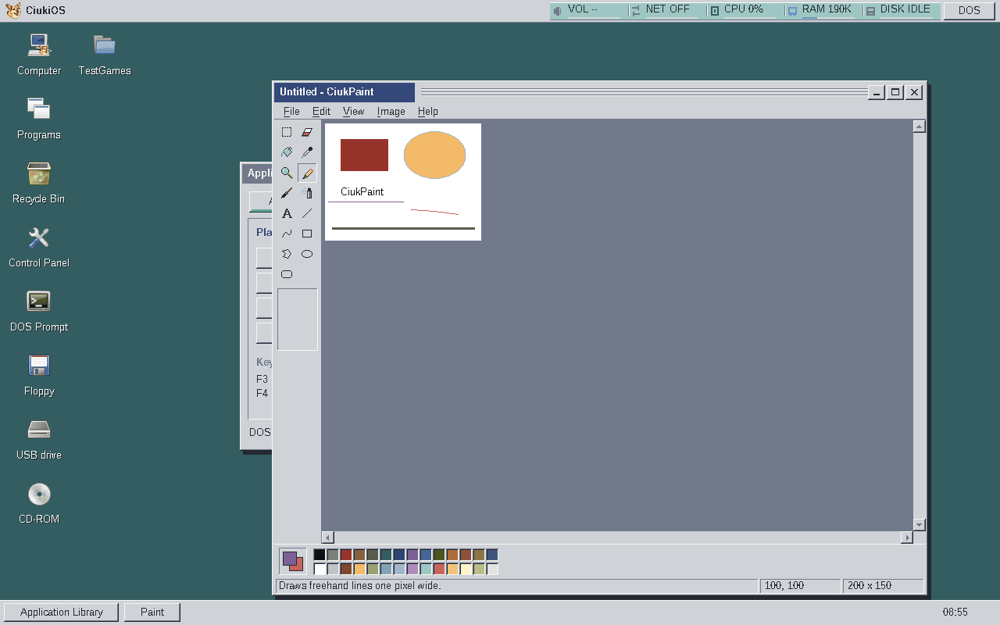 |
| Create, move and restore names beyond 8.3. | The stroke appears while the mouse button is held. |

| Native CiukWeb | About CiukiOS |
| --- | --- |
| 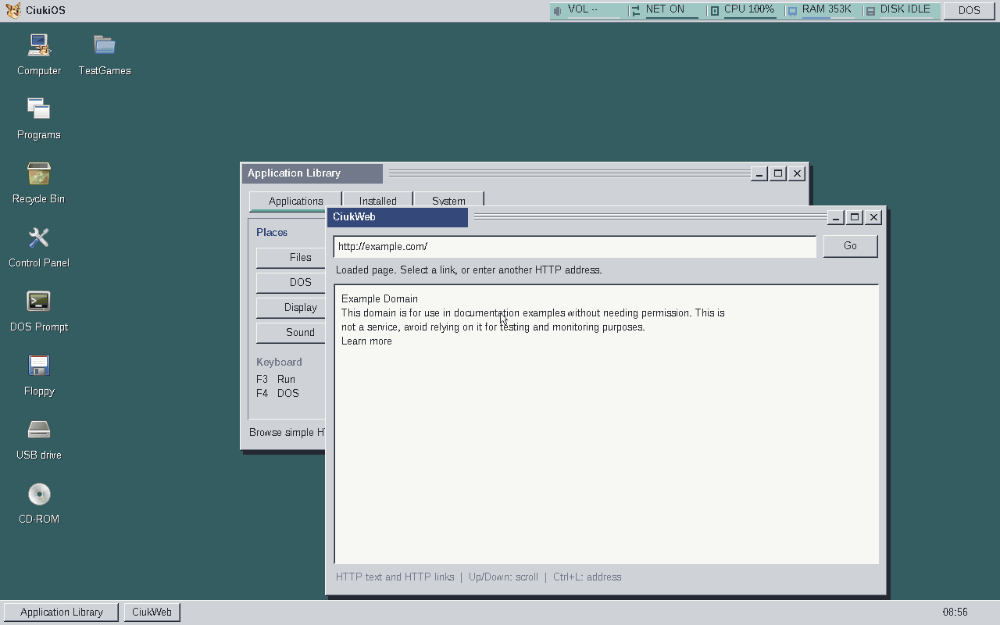 | 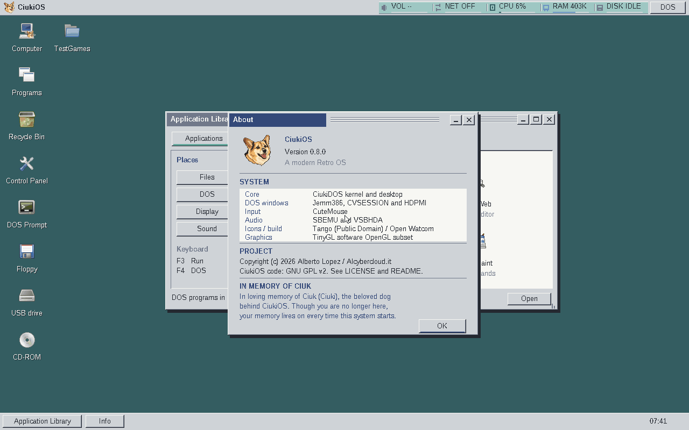 |
| A native desktop window renders simple HTTP pages. | Version, component credits, GPL notice and Ciuk's dedication. |

### DOS windows and graphics

| DOOM with Files open | Two independent DOS VMs |
| --- | --- |
| 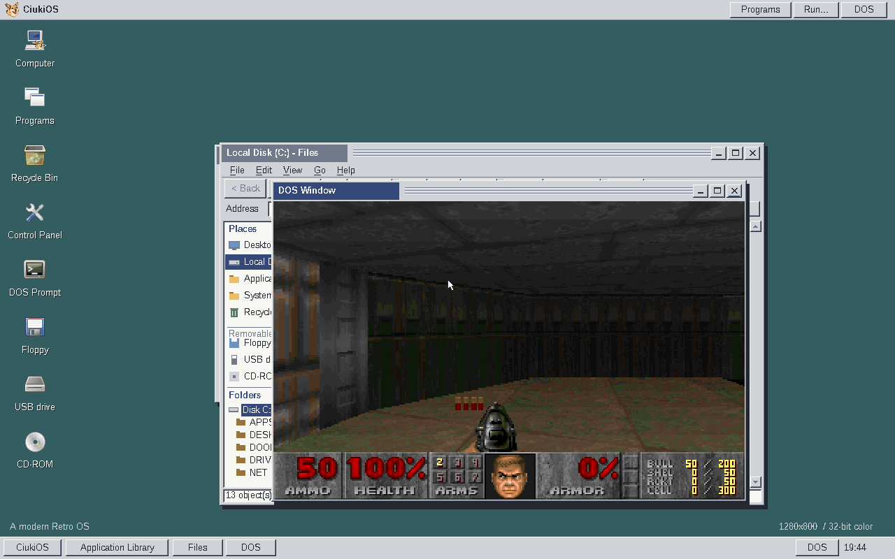 | 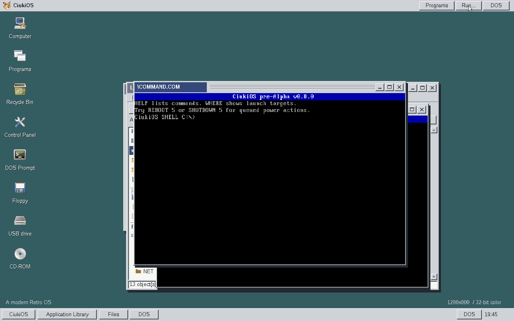 |
| M4 runs a DOS program in its own forked VM. | Each window has its own memory, focus and close action. |

| TestGames on the desktop | Software OpenGL demo |
| --- | --- |
| 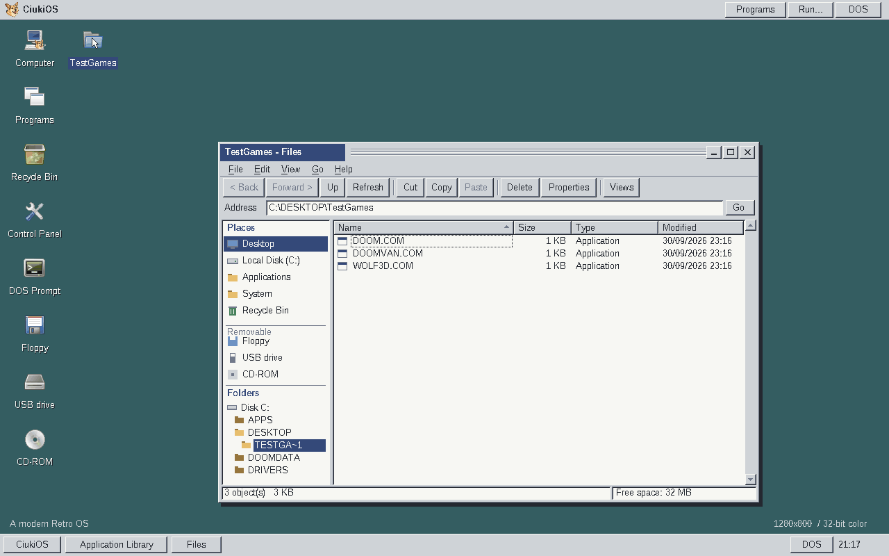 | 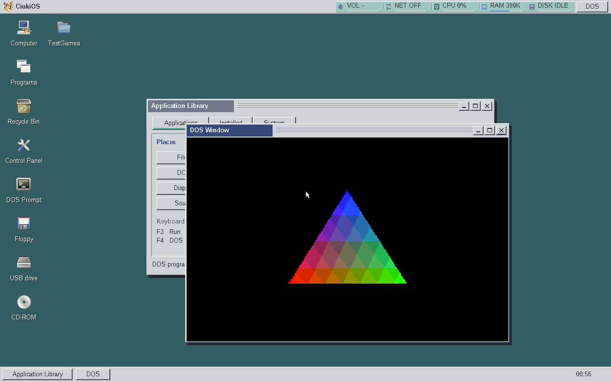 |
| Launchers group the DOS game tests without copying game data. | TinyGL draws through a DOS/4GW library; guest GPU acceleration is still open. |

### Settings and system tools

| Advanced network settings | CiukiOS Settings Registry |
| --- | --- |
| 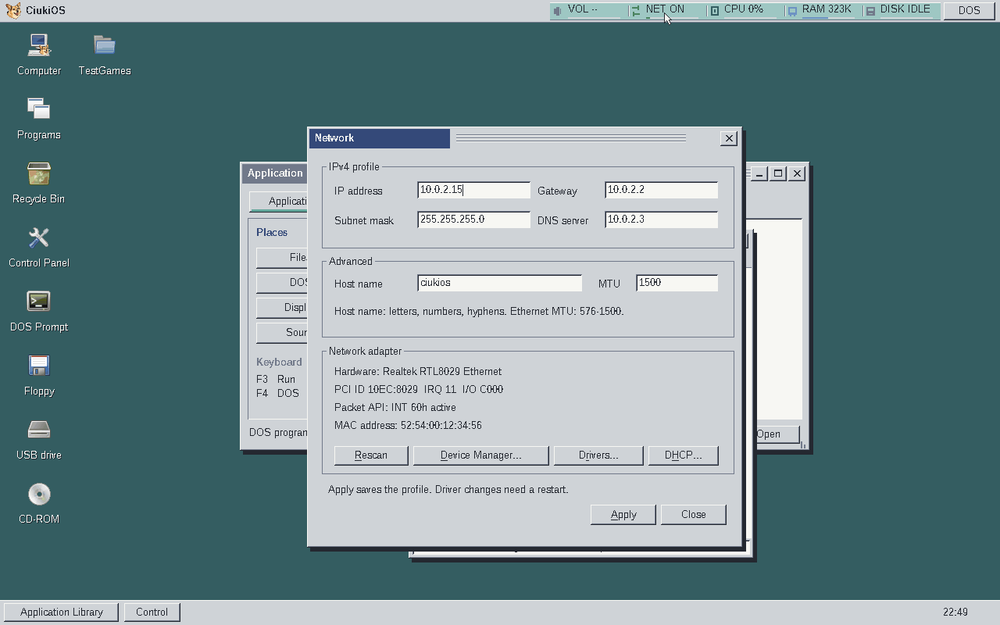 | 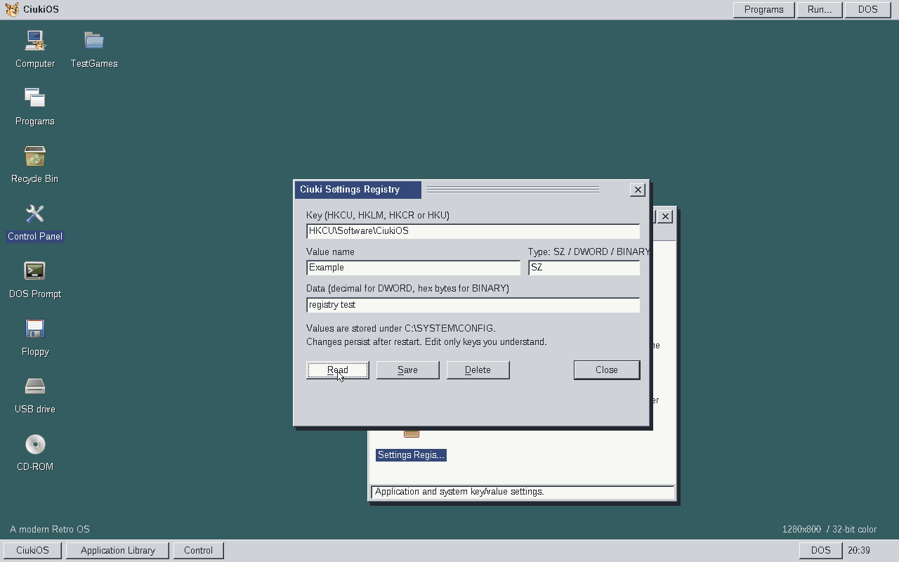 |
| IPv4, DHCP, host name, MTU and adapter details. | Persistent CiukiOS values; Win32 registry APIs are not implemented. |

[See the refined date and time control](docs/validation/2026-10-01-clock-network/README.md), including its network time-zone setting.

## What works

| Area | Current capability |
| --- | --- |
| DOS windows | M4 runs DOS programs in separate V86 machines with virtual VGA, input and sound. DOOM and doom-vanille run in windows while Files stays open. |
| Desktop | Files, CiukNote, CiukPaint, Task Manager, Control Panel, Recycle Bin, long FAT16 names and customizable settings. |
| Network | Packet networking, IPv4/DHCP settings, FTP and CiukWeb's first HTTP text/link view. |
| Native development | C/OpenWatcom `.APP` desktop modules, 32-bit DOS/4GW programs and a TinyGL software library. |
| Windows preparation | Settings Registry and PE32 detection; Windows 95/98 programs are reported as unsupported. |

The current image has **26/26 VM-window gates passing across serial QEMU runs** on the same disk image. A host reboot interrupted the single-command profile, so this is a [combined result](docs/validation/2026-10-01-native-app-gl/serial-summary.json), not one uninterrupted suite run. Focused gates also cover live painting, CiukWeb, TinyGL and cursor movement during DOOM. [Read the validation boundary](docs/validation/2026-10-01-native-app-gl/README.md).

QEMU runs on the development computer to test CiukiOS. CiukiOS does not run QEMU inside itself; its DOS windows use native x86 V86 execution with virtual devices.

## Run it

On Linux, the build-and-launch script fetches verified optional components, builds the FAT16 image and starts QEMU:

```bash
bash scripts/build_run_full.sh
```

For a fixed 1280×800 recording window, after building:

```bash
bash scripts/qemu_record_full.sh
```

The build requirements, image profiles, lighter host settings and focused test commands are in the [build and run guide](docs/build-and-run.md). Commercial game data and other proprietary payloads are **not** published in this repository; local copies are optional for private testing.

The full build also produces a [portable Windows ZIP](docs/windows-portable-release.md)
with QEMU and a clean CiukiOS image, ready to extract and launch without an
installer. Local pushes to `main` publish the ZIP as a dated, numbered GitHub
Release through a Git hook; no GitHub Actions are used. The Windows launcher
remains untested on Windows.

## What's next

- Fix Wolf4GW's lost mouse input and close failure in an M4 window; extend M5's protected-mode concurrency tests.
- Add an installable `.APP` manifest, loader and SDK, then move CiukWeb from `HTGET` to a native TCP service with HTTPS support.
- Build a real PE32/Win32 runtime before claiming Windows 95/98 games or installers. Today they do **not** run.
- Expand the driver catalog, CD/USB support and DOS compatibility corpus. Qualify physical PCs separately from QEMU.
- Extend software graphics beyond the first TinyGL subset; guest GPU acceleration and full OpenGL support remain open.

The [project status](docs/project-status-2026-10-01.md) gives the complete list of limits and priorities.

## Recent chapters

| Date | Progress and debugging |
| --- | --- |
| **26–29 Sep 2026** | Native desktop, file manager and device model; M1–M3 gave DOS sessions private memory and peripherals. |
| **30 Sep 2026** | M4 moved DOS-window ownership out of `SHELL.COM`; long names, CiukNote, CiukPaint, driver management and TestGames followed. VM focus, IRQ and memory faults took several QEMU iterations to fix. |
| **1 Oct 2026** | Refined the top bar and About, added advanced network settings, CiukWeb and TinyGL, and fixed live painting, VM timer calibration and SB16 completion timing. |

See the [changelog](CHANGELOG.md) for the dated record and the [M4 validation](docs/validation/2026-09-30-m4/README.md) for the detailed debugging trail. Development hours were not recorded, so no time total is claimed.

## Documentation

| Start here | Detail |
| --- | --- |
| [Current status](docs/project-status-2026-10-01.md) | What works, what is untested and the next milestones. |
| [Build and run](docs/build-and-run.md) | Dependencies, disk image, QEMU and light test workflow. |
| [Native apps and OpenGL](docs/native-apps-and-opengl-2026-10-01.md) | C formats, CiukWeb and the TinyGL boundary. |
| [Windows compatibility](docs/windows-compatibility-and-layout-2026-09-30.md) | Registry groundwork, free PE probes and missing APIs. |
| [Network settings](docs/network-settings-2026-10-01.md) · [Recording and web](docs/qemu-recording-and-web-2026-10-01.md) | Configure networking and capture a stable QEMU window. |
| [Roadmap](Roadmap.md) · [Milestone ledger](docs/current-milestones.md) | Phases and historical evidence. |

## Project and license

CiukiOS project code is licensed under [GNU GPLv2](LICENSE). Bundled third-party programs, drivers, fonts, sounds and icons keep their own notices; see the relevant `assets/` directories. The approved Ciuki portrait is a separate project asset, not Tango Public Domain artwork. The About panel credits the open-source modules, [Alcybercloud.it](https://www.alcybercloud.it/it) and Ciuk.

Contributions and reproducible compatibility reports are welcome. [Support the project](DONATIONS.md).
