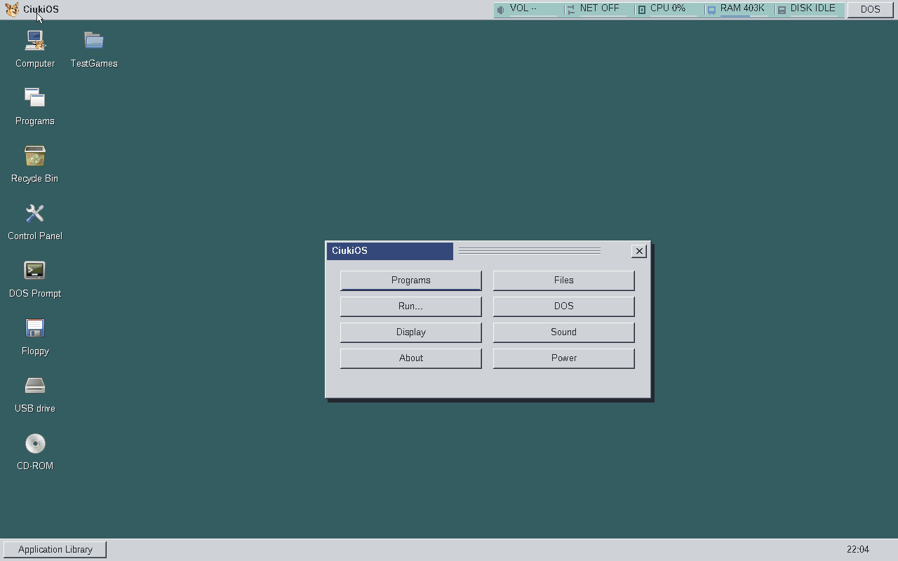
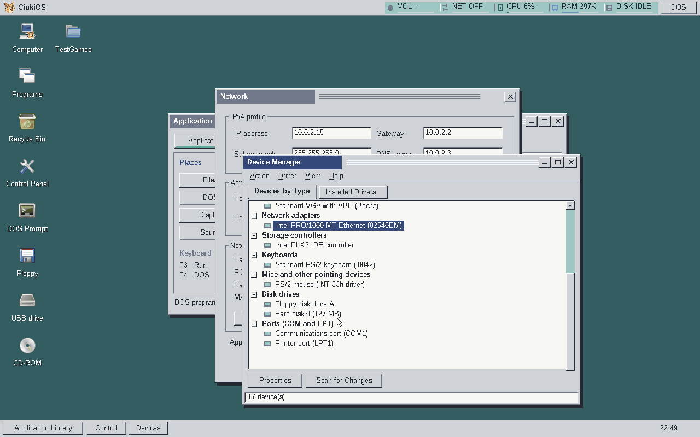
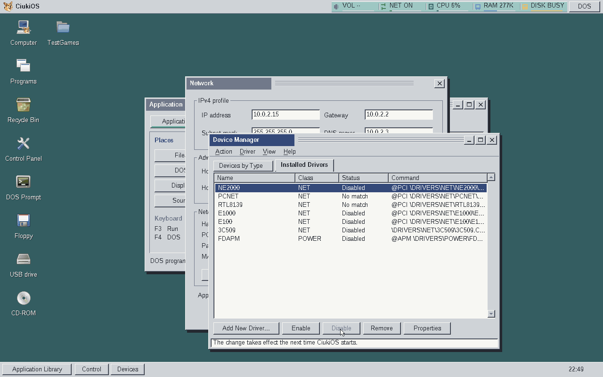
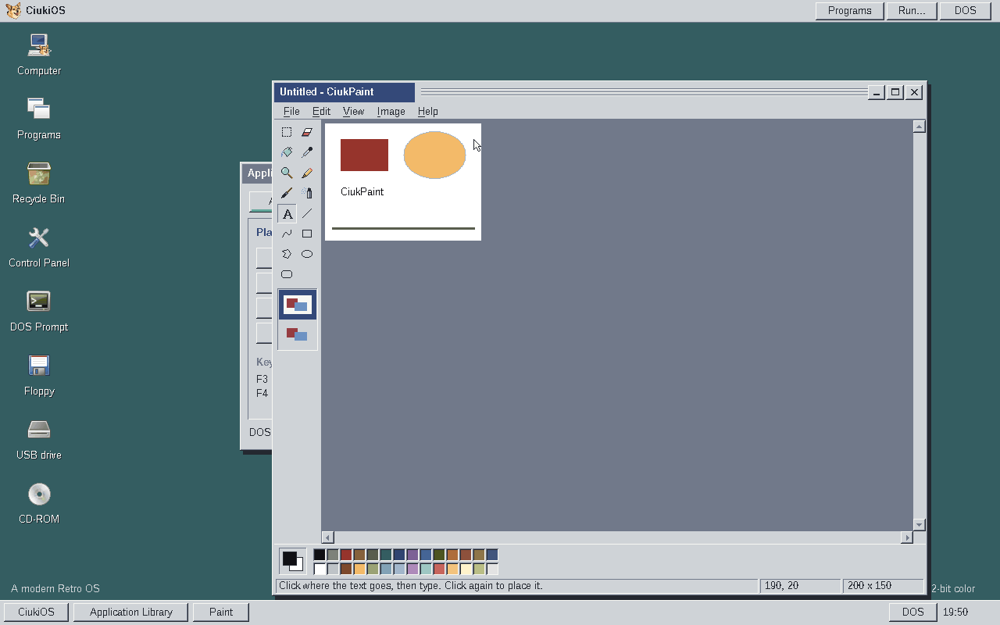
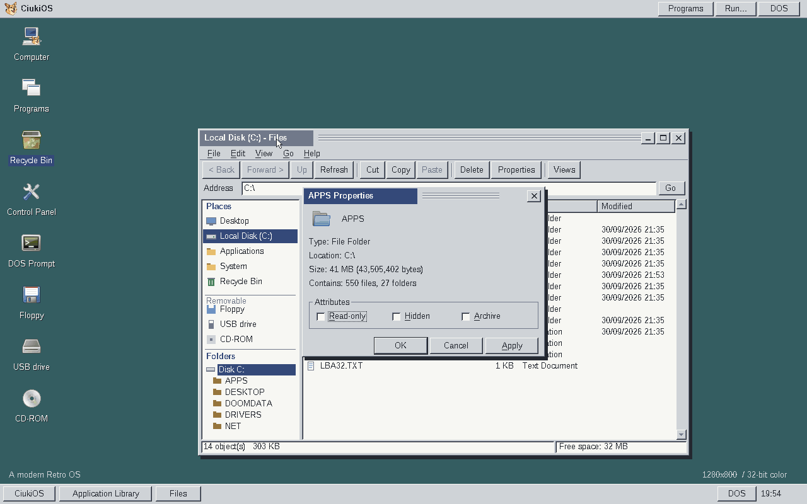
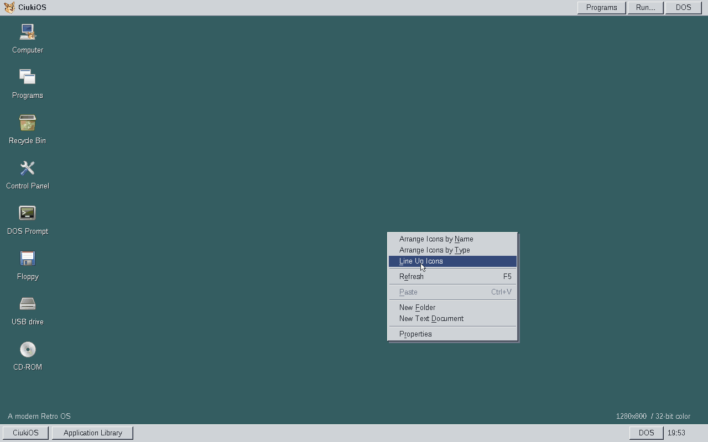
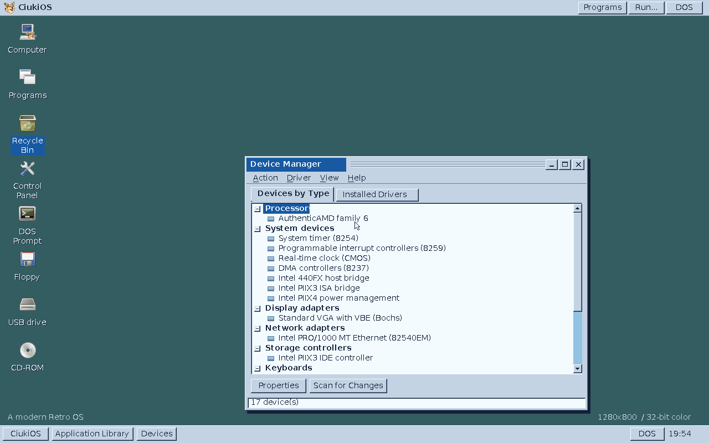
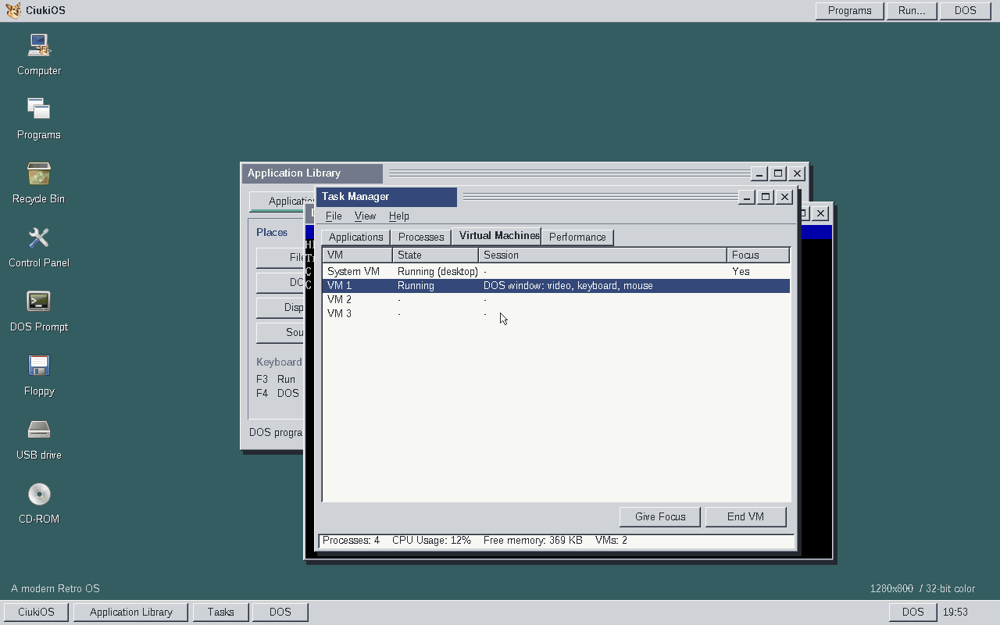
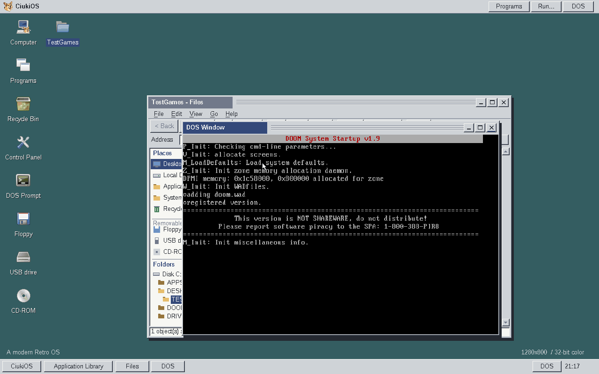
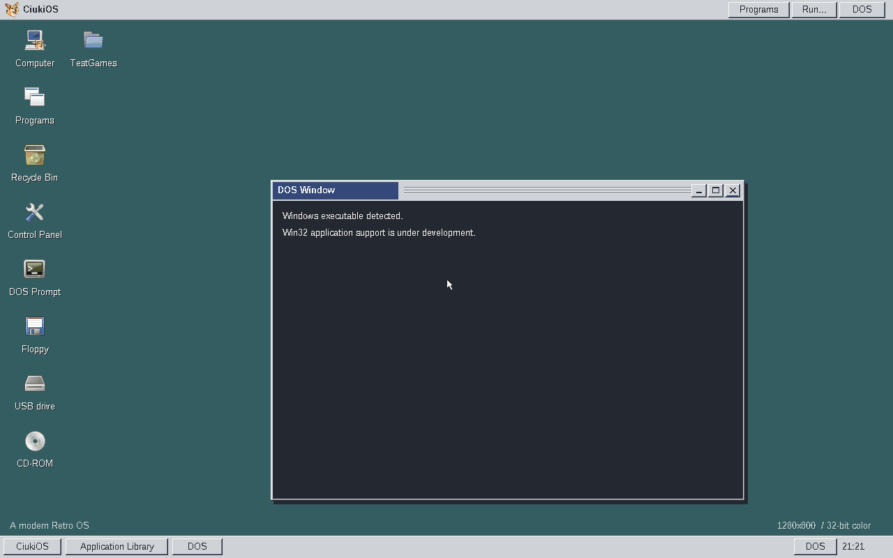

# CiukiOS

CiukiOS is dedicated to **Ciuki**, the dog in the boot splash. Its logo uses
the owner's approved portrait of him, converted deterministically for the
renderer; see the [Ciuki visual identity](assets/brand/README.md).
The [official system icons](assets/icons/README.md) use the Public Domain
Tango 0.8.90 family, with Ciuki's approved portrait on identity icons.

CiukiOS is a personal open source retro-computing project: a small legacy BIOS x86 operating system rebuilt from a clean baseline.

The long-term goal is to support DOS and pre-NT software progressively, without CPU emulation in the final runtime path. The current system boots into a native desktop above its MS-DOS/FreeDOS-inspired runtime, with the FAT16 `full` profile as the main compatibility lane.

CiukiOS is not a finished operating system. It is an active learning and research project, built in spare time with AI-assisted development workflows and a lot of low-level debugging.

## Current Milestone

Current development version: `CiukiOS pre-Alpha v0.8.0`.

The [current project status](docs/project-status-2026-10-01.md) separates
working features, QEMU evidence and open work. In particular, Windows 95/98
PE programs are detected but cannot run, CiukWeb is an early HTTP browser,
and the OpenGL path currently renders in software.

**DOS windows as virtual machines (M4 complete in QEMU, 2026-09-30).** The development
image starts a resident VM manager at boot. The current implementation runs DOS
programs in separate V86 virtual machines:
- Each VM has private conventional memory and BIOS RAM, and its own virtual
  VGA, keyboard, mouse, PIC/PIT, DMA, SB16 and OPL model.
- Ctrl+Esc returns keyboard focus to the desktop. The focused QEMU M4 gate
  also passes click focus between two DOS VMs after closing DOOM.
- One AC'97 stream plays the focused session's sound. The other sessions keep
  running muted in real time.
- Clocks, file I/O from several VMs, and ending or killing a VM are covered by
  gates.

Phase 2 milestones M1-M3 pass on QEMU. Their complete VM profile passed 21/21,
and the VM-manager gate passes 10/10 parts
([evidence](docs/validation/2026-09-29-boot-and-m3/README.md),
[design](docs/design-multi-vm-2026-09-28.md),
[roadmap](docs/roadmap-dos-vm-desktop-2026-09-28.md)). M4 now paints each VM
session in a desktop window, including DOOM with Files open. Its focused
multi-window QEMU gate passes rendering, focus, input and bounded close for
both original DOOM and doom-vanille on the final development image. The last
guest I/O gate passed real DOS INT 33h mouse movement and clicks,
SB16/OPL output and captured PCM audio
([evidence](docs/validation/2026-09-30-m4/README.md)). The updated full
VM-window profile passes **26/26** gates on the 0.8.0 image, including text,
VGA, guest I/O, DPMI, Task Manager VM controls, original DOOM,
doom-vanille, DOS memory and desktop applications. This completes M4's
tested QEMU scope; physical hardware remains unqualified.

The boot now goes from the splash straight to the desktop, with the startup
melody and no text screen. Windows 3.1 support was removed on 28 September
2026.

**Desktop applications (2026-09-29).**
- **Files:** Explorer/Dolphin style, with Places, address bar, Details,
  Icons and List views, right-click menus, new folder, cut/copy/paste,
  rename, delete, properties and removable media.
- **CiukNote:** a classic desktop text editor with Find/Replace, Go To,
  Time/Date, `.LOG`, Page Setup and Print to LPT1.
- **CiukPaint:** an original bitmap editor with drawing tools, selections,
  undo and BMP import/export.
- **Task Manager:** Applications, Processes, Virtual Machines and
  Performance with CPU history.

These are separate modules in `\SYSTEM\APPS`, hosted by the desktop.

Shortcuts:
- Win (Programs), Win+R (Run), Win+E (Files), Win+D (desktop);
- Alt+F4, Alt+Tab;
- Ctrl+Shift+Esc and Ctrl+Alt+Del (Task Manager);
- the Menu key and Shift+F10.

See [the record](docs/desktop-apps-2026-09-29.md).

### Historical desktop snapshot — 26 September 2026

The selected desktop image from **2026-09-26** includes Files, Tasks,
Display, Sound and Wallpaper windows. CD-ROM, floppy and BIOS-exposed disks
open in Files for read-only browsing, text preview and file import. USB must be
exposed by firmware before boot; there is no native USB hot-plug stack.
Wallpaper supports 99 indexed tiles, persistent selection and Refresh after
copying converted PNG/BMP files. Default builds include three original CC0
patterns; the owner's Windows wallpapers remain an optional personal payload.
Kenney CC0 event sounds play through native ICH AC97 or supported Sound Blaster
hardware, with graphical previews, mute and explicit failure messages.

At that date, the DOS window ran one restricted BIOS-text foreground process through the
actual DOS kernel. The Doom and Wolf3D window previews are cooperative source
ports, with no game audio. Original DOS graphics programs with audio did not
yet run in native windows. Ctrl/Space qualification concerns the Doom preview;
it is not evidence for the original game. An isolated monitor experiment now
provides shadow video, bounded DPMI port/memory probes and protected framebuffer
copying; complete desktop presentation and peripheral ownership remain open. F4 retains the
fullscreen DOS compatibility path; `EXIT` or `DESKTOP` returns to the desktop.

The selected 128 MiB development disk image is
`build/full/native-desktop-2026-09-26/final/ciukios-native-desktop.img`, SHA-256
`08bc6df6510e55e3f501d49f9414e2d0f0a2006eccdda5dbf8f78bdc1e244bd6`.
Eleven focused reports pass on that image in QEMU with a Pentium III CPU model
and 128 MiB RAM. They cover keyboard chords, native media, console memory,
wallpaper import/pixels, AC97/SB PCM, negative audio paths and DOS handoff.
They do not requalify the entire historical application matrix or physical
T23/E500 hardware. This personal image is not a public software distribution.
See [the implementation and evidence record](docs/native-desktop-2026-09-26.md),
[archived validation reports](docs/validation/2026-09-26/validation.json),
[adding wallpapers](docs/wallpaper-import-2026-09-26.md) and
[removable-media limits](docs/native-removable-media-2026-09-26.md).

A subsequent **opt-in monitor experiment**, developed through September 27,
builds pinned Jemm/JLOAD and an external session module without enabling them in
normal boot. V86 and protected-mode VGA accesses now reach the same software
model through memory faults, port traps and a bounded BIOS bridge. The native
desktop can present the V86 session in a resizable window. Five VGA checkpoints
match QEMU's native pixels; the unchanged DOS Navigator FIRE executable runs in
that window, including focus changes, cover/uncover and minimize/restore.
Official HDPMI 3.24 uses separate client page tables and its unchanged API-6/7
callback ABI. Lifetime probes execute the packaged `DOOMVAN/PCDMCORE.EXE` DOS
engine unchanged, repeat clients and unwind a deliberate fault. That executable
is distinct from the proprietary original Doom and the cooperative window port.

These tracks did not initially test the same binaries. The
[integration audit](docs/vm-integration-audit-2026-09-27.md) records exact inputs,
the first combined run, the defects found afterwards, and the completion runs.
In those runs the rebuilt HDPMI with guest virtual IF passes the combined
lifetime, VGA and window gates in QEMU, with host ticks running while guest
interrupts stay masked. The standalone keyboard, mouse, PIC/PIT, DMA, SB16 and OPL model
passes 912 assertions and now serves real-mode DOS programs in the session:
raw keyboard and a virtual INT 33h mouse that follow desktop focus, and SB16
DMA plus OPL streamed to the AC'97. The V86 IF profile is negotiated at
runtime. Protected-mode (HDPMI) clients are not attached yet. The measured FIRE window
rate is about 18 repaint/s on the test host, not 30 fps or a Pentium III hardware
result. See [video evidence and limits](docs/vm-video-session-2026-09-27.md) and
[the peripheral record](docs/vm-input-audio-devices-2026-09-27.md).

The kernel's extended XMS functions and persistent DOS device chain are fixed;
the experimental kernel is 43,217 bytes, 47 bytes below its unchanged ceiling.
At that time the Windows 3.1 gate (since removed) also passed two launches,
resize/repaint and measured WAV/MIDI playback. A separate classic Doom fullscreen regression passes real
menus, gameplay, movement, audio and clean return on the new kernel. These results
do not qualify original games in desktop windows, complete virtual peripherals,
30 fps or real hardware. The selected desktop
image above remains unchanged. See [the monitor foundation and evidence](docs/vm-session-foundation-2026-09-26.md)
and [the actual Jemm/HDPMI interface contract](docs/vm-dpmi-contract-2026-09-26.md).

The approved Ciuki portrait, original boot photo, startup melody and Tango
icons remain the system identity. UI text is English: **A modern Retro OS**.

### Earlier milestone evidence

The phase records below summarize earlier bounded results. Their dates and
profiles matter: the September 26 desktop checks do not repeat every game,
Windows, installer or physical-hardware test.

The Phase 4 DOOM gameplay milestone is closed. The full FAT16 runtime can launch DOOM through DOS/4GW, load `doom.wad`, initialize the gameplay path, and reach a playable visual runtime.

Phase 5 is **COMPLETE; NORMAL DOS RUNTIME OWNERSHIP CLOSED**. Its earlier closure record used a 1,542-byte loader-only Stage1, a kernel loaded at segment `0x0900`, a 43,264-byte kernel and five EXEC snapshot frames. The current placement and sizes are recorded in [the runtime ledger](docs/current-milestones.md#canonical-runtime-boundary). The ownership contract remains `ABI=2`, 11 descriptors of 8 bytes, capability mask `0x003F`, and no Stage1 compatibility chain (`CIUKRTST CHAIN=0`). Stage0 reads 8 sectors from the 72-sector BPB-reserved Stage1 slot. CIUKIDOS owns the DOS runtime and launches the external `\SYSTEM\SHELL.COM`; missing or invalid required components, or an unexpected shell return, still fail closed to the bounded fatal path.

Phase 6 is active, not closed. The external GPL CuteMouse workflow passes on `full`, and the official MIT-licensed Costa v1.8.0 lane validates reproducible fetch/package/launch, the 640x350 desktop, one moving cursor, and the complete Desktop → Calculator nested-EXEC workflow. COM and MZ children use one title-independent first-fit EXEC allocator: COM placement derives from PSP+file+stack, while MZ placement derives from the real copy extent, header, `minalloc`, live MCBs, and arena limit. Doom-vanille now passes the focused DOS/4GW 256 KiB low-DOS allocation gate, real gameplay/HUD/wall validation, simultaneous AdLib/OPL2 music plus SB16 SFX, and a timedemo performance gate. Its required Watcom ABI options (`signed char`, 32-bit enums, one-byte structure packing) are applied automatically. DOSNavigator is packaged byte-for-byte from upstream and validates dual-pane startup, one-row arrow navigation, mouse input, Colors/XMS, native `Alt+X` exit, shell return, and same-boot PSP/mouse/video cleanup. It remains PARTIAL only because broad file-operation/editor and full-CD workflows are not recorded. The packaged WOLF3D copy passes resource loading, stable runtime, keyboard-driven menu progression, and correctly rendered first-level video; it remains PARTIAL for unmodified-binary, clean-exit, full-CD, and audio compatibility. The required external corpus and five-category full-CD matrix are incomplete. Phase 7 is not closed: real-mode and DOS/4GW SB16 layers, controlled DOOMSFX, original Doom OPL2 music/PC-speaker gameplay, and doom-vanille combined OPL2/SB16 gameplay are green; original Doom SB16/DMX, clean return from a second external audio workload, full-CD audio, and real hardware remain open.

Phase 8 is now active with its first bounded milestone complete. The `full` profile packages the GPL mTCP/Crynwr stack, exposes NE2000 plus configurable IPv4 under QEMU, and provides bidirectional FTP sharing through `C:\SHARE`. `NETSTART` installs a resident ARP/ICMP bridge independent of FTP, `NETCFG` persists IP/mask/gateway/DNS, and `IPCONFIG` reports live values and service status. Isolated gates verify inbound and Internet ICMP plus FTP persistence without mutating the canonical image. This does not yet imply SMB, encrypted transfer, arbitrary NIC, DHCP-server interoperability, or physical-hardware support.

Phase 9 advanced early but is not closed; Windows 3.1 support was removed on 28 September 2026 in favour of CiukiOS's own DOS windows. Before that, with optional local media, Windows 3.1 reached 386 Enhanced Mode through the normal `WIN` command on the canonical `full` image. The bounded acceptance workflow proves one linear PS/2 pointer, native Sound Blaster startup WAV audio, real non-silent AdLib MIDI playback, generic DOS-prompt enter/exit, automatic memory for an unprofiled DOS/4GW Doom launch and clean return, Calculator launch and task-scoped `Alt+F4`, Program Manager survival, clean return to CiukiOS, and a second Windows launch. Windows 95/98, full-CD, broad application and multimedia coverage, printing, and hardware evidence remain open.

Validation snapshot (2026-09-01): the Phase 5 loader/kernel ownership boundary and ABI gate are green, together with the expanded `make qemu-test-all` bundle and its full-CD read beyond LBA 65,535. The aggregate covers the generic EXEC-memory policy guard, unmodified DOSNavigator mouse/navigation/Colors/native-exit plus same-boot cleanup, Costa desktop/cursor/Calculator, WOLF3D gameplay, original Doom gameplay plus non-silent WAV, doom-vanille gameplay/texture/audio plus 256 KiB allocation, Windows 3.1 Enhanced Mode/linear cursor/native SB and AdLib MIDI audio/generic DOS VM/unprofiled DOS4GW Doom/Alt+F4/exit/relaunch, CuteMouse, external `COMMAND.COM`, and shell COM/MZ/PSTACK/TSR return gates. The bounded mTCP ICMP/FTP gates remain focused lanes; normal COM launchers relocate their stack and shrink their own DOS block before nested EXEC, without kernel program-name rules. `make qemu-test-setup-runtime-hdd-install` remains a separate long gate and is not included in `qemu-test-all`.

Current work follows the [DOS-window roadmap](docs/roadmap-dos-vm-desktop-2026-09-28.md), phase 2 (several DOS windows at once):

1. M4 completed on QEMU: the desktop paints each VM's session in its own window and sets the focus with a click; the DOS-window manager moved out of SHELL.COM
2. M5: broaden and qualify the DPMI host across simultaneous protected-mode VM workloads
3. qualify original-binary video/audio, clean return and measured performance, followed by separate T23/E500 checks

The wider compatibility backlog remains:

1. hardening logical JFT/SFT, handle, process, and file semantics as Phase 6 compatibility work without reopening the closed Phase 5 ownership boundary
2. keeping the aggregate, runtime-negative, shell, and installer gates green on the same checkout
3. expanding the Phase 6 matrix with meaningful external-application workflows on both `full` and `full-cd`
4. removing workload-specific compatibility patches where a general DOS subsystem fix is possible
5. retaining the verified original Doom OPL2/PC-speaker and doom-vanille OPL2/SB16 paths while keeping the unresolved original Doom SB16/DMX behavior explicitly separate
6. keeping the bounded Packet Driver/IPv4/FTP lane green while DHCP, other NICs, encrypted protocols, and physical networking remain explicit Phase 8 follow-ups
7. DOS applications in desktop windows, Windows 95/98 style (resident VM manager, several DOS windows, control panel, file manager): see `docs/roadmap-dos-vm-desktop-2026-09-28.md`

## Development changelog and QEMU screenshots

This record follows the dated commits and validation runs. Development time was
not logged in hours, so the dates and debugging detours below describe the
effort without inventing a total. All screenshots are unedited QEMU captures;
[capture provenance](docs/screenshots/0.8.0/README.md) lists the source run for
each one. Physical PCs have not been qualified by these images.

### 1 October 2026 — desktop top bar

The Ciuki portrait and name now open the system menu from the upper left.
The lower bar is reserved for the Application Library and running windows;
the duplicate CiukiOS and DOS buttons were removed. The upper right uses
one aligned strip for volume, network, CPU, free conventional memory and disk
activity. Each section is clickable: volume opens Sound, network opens its
IP configurator, and the three system readings open Task Manager's
Performance page. The indicators use small meters and change colour on
activity; `--` means that no supported volume mixer was found. The wallpaper
no longer carries a resolution label or tagline overlay.

About now separates the system components, project credits and approved
dedication into readable sections. Network settings can save IPv4, DNS,
host name and Ethernet MTU; invalid masks, names and MTUs are rejected before
the profile is changed. The adapter section shows detected PCI hardware,
resources, packet API and MAC address. Its buttons rescan devices, open the
matching Network adapters view in Device Manager, open installed network
drivers for enable/disable, or request DHCP. Driver changes take effect after
a restart. The DHCP action starts the Ciuki network service when needed and
returns to the desktop after saving the lease. These are QEMU captures of the
current development image; [network settings and limits](docs/network-settings-2026-10-01.md)
describes the controls and their runtime behavior.

| Refined desktop and system menu | About and network settings |
| --- | --- |
| <br>Unified top bar with separate activity and resource readings. | <br>The Ciuki portrait and name open the system menu. |
| <br>Version, component credits, GPL notice and dedication. | <br>IPv4, advanced fields and the detected adapter. |
| <br>The Network button selects the detected adapter. | <br>NE2000 disabled; the next QEMU boot omits its load. |

### 1 October 2026 — fixed recording window and native web page

The recording runner sizes QEMU before CiukiOS boots, then keeps a 1280×800
client window while the guest switches between its 1024×768 desktop, DOS text
and VGA modes. It uses
KVM, QEMU's user-mode Internet NAT, NE2000, sound and GTK OpenGL display
presentation. The OpenGL setting uses the host graphics path; DOS software
still sees an emulated VGA card. The existing `--vga-fast` profile remains an
optional experiment for verified Doom-vanille workloads. Its current
sound-off fullscreen timedemo passed at 194 realtics for 350 gametics; that
result does not measure original Doom or a windowed game.

The full image includes `HTGET` and **CiukWeb**, a native C desktop module.
In QEMU, it fetched `http://example.com/` through the existing mTCP utility
and displayed the page in its own desktop window. Application Library opens
CiukWeb directly; MicroWeb is no longer preinstalled. CiukWeb handles its
window and simple HTML text in native code while TCP retrieval still uses
HTGET. [Recording and web instructions](docs/qemu-recording-and-web-2026-10-01.md)
describe the first HTTP-only workflow and its limits.


### 1 October 2026 — native C applications and software OpenGL

C/OpenWatcom is the selected language for desktop `.APP` modules and 32-bit
DOS/4GW programs. The image now includes a SHA-256-pinned TinyGL static
library, header, license and a demo under `C:\SYSTEM\GL` and
`C:\PROGRAMS\CiukGL`. In QEMU, the software renderer drew a coloured
triangle inside an M4 DOS window, then returned on Escape. This is an
OpenGL-style subset for DOS programs, with no guest GPU acceleration or
Win32 DLL compatibility. The [native app and graphics plan](docs/native-apps-and-opengl-2026-10-01.md)
records the current executable formats and remaining SDK work.


### 1 October 2026 — live drawing and DOS window repaint

The desktop now presents a module's queued damage before it polls a DOS VM
or sleeps. CiukPaint's QEMU gate captures a pencil mark while the mouse
button remains pressed. DOSVM also redraws only the horizontal range of
video bands reported as changed by CVSESSION, which reduces unnecessary
painting for quieter DOS screens. With a text DOS window open, QEMU consumed
a visible pointer move in 0.122 s, versus 0.063 s on the idle desktop in
the same gate. A second QEMU gate launched DOOM directly into level 1 and
measured 0.185 s with the game rendering versus 0.058 s on the desktop in
that run; its capture and measurements are in
[the validation notes](docs/validation/2026-10-01-native-app-gl/README.md).

Forked DOS windows now calibrate their TSC against the firmware timer before
starting virtual video and audio. A BIOS-tick-only measurement could report
an impossible rate when virtual ticks arrived late, making some COM/MZ
programs exit before their first instruction. The corrected QEMU text,
mouse/audio and VGA-window gates pass; the complete VM profile is recorded
as 26/26 combined gates on the current image in
[the validation notes](docs/validation/2026-10-01-native-app-gl/README.md).
The SB16 path also now delivers a virtual DMA-completion IRQ in the same
audio service pass that renders the PCM buffer; the DOOM Vanille SFX gate
passes with a recorded non-silent WAV stream.


### 0.8.0 development work — 30 September 2026

- **Desktop and identity.** The current desktop has drawn window controls,
  hover and disabled states, context menus, customizable settings, a Recycle
  Bin and the approved Ciuki portrait. The About window identifies the native
  CiukiDOS kernel, desktop and VM manager, credits key open-source components,
  names [Alcybercloud.it](https://www.alcybercloud.it/it), states the project's GPLv2 license and carries
  the dedication to Ciuk approved by the owner.
- **Files and long names.** A resident FAT16 long-name extension implements
  `INT 21h` 71xxh calls; Files and the desktop can create, rename, copy,
  recycle and restore names beyond 8.3. The former 8.3-only path is no longer
  the UI limit. QEMU long-name and filesystem checks passed on the final M4
  integration image.
- **Creative tools.** Notepad became **CiukNote**. **CiukPaint** was added as
  an original bitmap editor with drawing tools, selections, undo, text and BMP
  import/export. Its focused QEMU gate passed on the final image.
- **Devices.** Device Manager, driver installation UI and a packaged catalog
  of licensed era drivers were added. The QEMU driver-pack checks cover
  supported virtual NICs and failure handling on the final image; the catalog records the load
  rules and redistribution terms. QEMU coverage is not a claim about every
  physical PC from that era.
- **DOS windows (M4).** Original DOOM and doom-vanille reach
  gameplay in their own forked VMs while Files stays open. The focused QEMU
  gate passes bounded close,
  two text VMs, click focus, keyboard routing and independent close; Run
  responded 0.74 s after the click in that gate. The replacement behavioral
  harnesses and full 0.8.0 profile now pass **26/26** gates. QEMU runs
  native x86/V86 DOS execution in
  CiukiOS; QEMU is the external test machine, not an emulator inside the OS.
  A separate DOS guest I/O gate passed INT 33h mouse movement and clicks,
  SB16/OPL playback and measurable PCM capture.

| Desktop and applications | More of the 0.8.0 work |
| --- | --- |
| <br>Long file and folder names on FAT16. | <br>Original drawing tools and a test drawing. |
| <br>Files remains usable with an independent Properties window. | <br>Desktop context menu with New Folder and New Text Document. |
| <br>Detected devices and driver-management entry points. | <br>Virtual Machines tab with a selected DOS guest and focus/end controls. |

| DOS applications in their own VMs | Two simultaneous DOS windows |
| --- | --- |
| <br>DOOM gameplay while Files stays open; its VM closes independently. | <br>Two DOS prompts with separate VM focus and memory. |

These captures accompany the passing focused
[M4 gates and full 26/26 profile](docs/validation/2026-09-30-m4/README.md).

### After M4: TestGames and settings storage

The desktop now has a **TestGames** folder with launchers for the DOS games
used in the QEMU profiles. Files opens those programs in M4 DOS windows; the
game data remains in its existing installation directory. Application Library
shows system applications and an Installed page leading to `C:\PROGRAMS`,
which starts empty; automatic registration of installed programs is pending.
New image directories place configuration under
`C:\SYSTEM\CONFIG` and optional probes under `C:\SYSTEM\TEST`.
Wolf4GW currently reaches its sign-on screen but loses desktop mouse input in
QEMU; this compatibility defect remains open.
The extended game check exposed the problem after DOOM had passed M4. We
removed two obsolete desktop-port launchers when their older adapter failed
inside M4, contained unknown guest PS/2 commands inside the virtual controller,
and kept Wolf4GW as an explicit open case. No unrecorded development hours are
assigned to this detour.

Control Panel gained **Settings Registry**, an original CiukiOS editor for
persistent string, DWORD and binary values. A QEMU test saves a value, reboots,
reads it and deletes it. This storage is a foundation for future installer
work. General Windows 95/98 EXE and installer support is still open: a free
PE32 test program is recognized and shown as unsupported without hanging a
DOS VM. The [compatibility and layout note](docs/windows-compatibility-and-layout-2026-09-30.md)
records the missing runtime pieces and the free tests selected for them.

| TestGames and DOS launch | Settings Registry |
| --- | --- |
| <br>Launchers for DOOM, DOOM Vanille and Wolfenstein 3D in one desktop folder. Wolfenstein still has an M4 mouse and close defect. | <br>A saved value read back after a reboot. |
| <br>DOOM starts in a native DOS VM from Files, which stays open. | <br>A free PE32 probe is recognized and receives an honest unsupported message; Win32 APIs remain to be implemented. |

### How the project reached this point

- **May–July 2026:** CiukiDOS gained FAT16 file creation, shell and program
  execution checks, VBE banked graphics and game timer/keyboard services.
  WOLF3D and DOOM regressions exposed loader, video and DOS memory faults.
  In July, tracing a DOOM launch failure found a leaked trap flag in the
  `INT 21h` allocation search; fixing the cause restored that path.
- **1 September 2026 — v0.7.1:** the first documented compatibility release
  closed its selected milestones. The older [changelog](CHANGELOG.md) retains
  detailed entries and their original dates.
- **26–27 September:** the native graphical desktop, media access, wallpaper
  and sounds arrived. Jemm386/CVSESSION gained monitored V86 video, a
  negotiated virtual-interrupt profile and guest keyboard, mouse and audio
  devices. QEMU tests caught lost IRQ1, extra timer interrupts and video
  frames painted to a hidden page; each required a separate fix.
- **29 September:** phase 2 M1–M3 gave several DOS VMs private conventional
  memory and sessions. Files, the text editor and Task Manager moved into
  desktop modules. M4 then moved DOS-window ownership out of SHELL.COM so
  each window could display its own forked VM.
- **30 September:** the long-name work hit both the 43,264-byte kernel ceiling
  and the 64 KiB module group limit. The resident extension and module-memory
  changes made the feature fit. M4 also exposed a narrow HDPMI image-size
  boundary and a physical IRQ path that overwrote the game's EAX register;
  the build now checks that boundary and the IRQ handler saves the register.
  The subsequent input fix restored click focus between DOS windows and
  forwarded desktop mouse packets into an inherited DOS INT 33h driver;
  original DOOM, doom-vanille and the guest I/O gate now pass that path.

## Quick Start

On Linux, the complete build requires `nasm`, `mtools`, `ffmpeg`, `patch`,
`make`, host C/C++ build tools, and the IA-16 cross-tools `ia16-elf-gcc`,
`ia16-elf-ld` and `ia16-elf-objcopy`. Install OpenWatcom under `/opt/watcom` or
set `WATCOM` to its installation directory; the DOS game and driver builds use
its compiler, linker and librarian. Python needs Pillow and `tarfile` extraction
filters (`extractall(..., filter='data')`): Python 3.12+ provides them, as do
older releases with the relevant backport. The selected development environment
uses Python 3.14.7.

QEMU checks require `qemu-system-i386` or `qemu-system-x86_64`; CD generation
also needs `xorriso`, with Syslinux BIOS files for the fallback ISO. Regenerating
the desktop font additionally requires Fontconfig's `fc-match` and Liberation
Sans; the generated font asset is already included, so this is optional for
ordinary builds.

Fetch the verified Costa release, build the complete FAT16 image, verify the runtime boundary, and open QEMU:

```bash
bash scripts/build_run_full.sh
```

At the CiukiOS prompt, type `costa`. Set `CIUKIOS_FETCH_COSTA=0` only when intentionally building without downloading the optional payload.

For a Doom-vanille performance session, use `bash scripts/build_run_full.sh --vga-fast`. On QEMU 11.1 this opt-in profile must not be used for the local original Doom binary; the normal command keeps the stable KVM default.

For a fixed-size video recording window after building the image:

```bash
bash scripts/qemu_record_full.sh
```

Use `--build` to rebuild first, or `--size 1440x900` to choose another fixed
client size. `--vga-fast` is available only for the measured Doom-vanille
experiment; original Doom stays on KVM. The runner needs an X11/XWayland
display and `xdotool`.

To share files with the host, run `NETSTART` and `FTPSRV`, then connect from Linux or Windows to `ftp://127.0.0.1:8021/` with `ciukios` / `ciukios`. See the network section below for exact commands.

Build the main FAT16 disk image:

```bash
make fetch-network-stack fetch-microweb
make build-full
```

Boot-test the main full profile in QEMU:

```bash
make qemu-test-full
```

Build the Live/install CD profile:

```bash
make build-full-cd
```

Smoke-test the Live/install CD profile:

```bash
make qemu-test-full-cd
```

Run the visual Live/install CD profile:

```bash
make qemu-run-full-cd
```

Run the active aggregate validation lane:

```bash
make qemu-test-all
```

Generated images are written under `build/full/`. The main full-profile disk image is `build/full/ciukios-full.img`; the primary Live/install CD image is also emitted with its version (`build/full/CiukiOS_full_cd_0-8-0.iso`), while `build/full/ciukios-full-cd.iso` remains the stable alias. The release CD uses GRUB4DOS to load a compressed 44.5 MiB image into a 96 MiB RAM disk before CiukiOS starts, so `SETUP.COM` clones RAM to HDD. Its recovery menu loads the uncompressed image through GRUB. `build/full/ciukios-full-cd-isolinux.iso` retains the original loader for diagnostics; `build/full/ciukios-full-cd-direct.iso` retains the direct-ATAPI diagnostic path.

## Active Profiles

| Profile | Status | Purpose | Main commands |
|---|---|---|---|
| `full` | Active default | FAT16 C: disk image, shell-first runtime, DOS compatibility, DOOM/WOLF3D work, driver helper probes | `make build-full`, `make qemu-test-full` |
| `full-cd` | Active install/live media | Bootable Live/install CD, D: shell profile, destructive HDD install flow through `SETUP.COM` | `make build-full-cd`, `make qemu-test-full-cd`, `make qemu-run-full-cd` |
| `floppy` | Legacy/minimal | 1.44MB loader-only bring-up scaffold; no CIUKIDOS DOS-runtime claim | `make build-floppy`, `make qemu-test-floppy` |

Default validation should use the `full` lane first. Use `full-cd` when the change touches Live/install media, D: shell behavior, setup, direct ISO boot, or real-hardware install paths. Do not treat the floppy profile as the default release gate unless a task specifically targets it.

## Validation Lanes

Common focused lanes:

```bash
make qemu-test-full
make qemu-test-full-cd
make qemu-test-full-dos-compat-smoke
make qemu-test-full-dos-taxonomy
make qemu-test-full-doom-taxonomy
make qemu-test-full-wolf3d-taxonomy
make qemu-test-full-costa
make qemu-test-full-network-ftp
make qemu-test-full-network-icmp
make qemu-test-full-cutemouse
make qemu-test-full-doomvan-memory
make qemu-test-full-doomvan-audio
make qemu-test-full-doomvan-performance
make qemu-test-full-doom-audio
make qemu-test-full-dos-audio
make qemu-test-full-video-restore
make qemu-test-full-drvload-smoke
make qemu-test-full-shell-stability
make qemu-test-setup-runtime-hdd-install
```

Use `make qemu-test-all` for the active aggregate smoke bundle. These commands describe the intended gates; documentation or release claims require a fresh result from the same checkout. Focused taxonomy lanes classify runtime stages and should not be upgraded to release claims unless the requested minimum stage and observation window match the claim being made.

## DOS Software And Third-Party Payloads

The repository does not publish commercial DOS game data or proprietary third-party binaries. Local payload directories may be used for private validation only:

1. `third_party/Doom` can be packaged into `C:\APPS\DOOM` when present locally.
2. `third_party/WOLF3D` can be packaged into `C:\APPS\WOLF3D` when present locally.
3. `third_party/DOSNavigator` can be packaged into `C:\APPS\DOSNAV` when present locally.
4. `third_party/drivers` can be packaged into `C:\SYSTEM\DRIVERS` when present locally.
5. `make fetch-costa` downloads the pinned official Costa v1.8.0 archive, verifies SHA-256 `254e79b7617bd96722d228731883ea2aeac982ee22e236d30fa0f9987430ee88`, and packages it into `C:\APPS\COSTA`.
6. `make fetch-network-stack` downloads pinned GPL mTCP and Crynwr packages, verifies both SHA-256 values, and packages tools, licenses, and sources under `C:\NET`.

Keep third-party payloads legally supplied, local, and untracked unless a license explicitly permits redistribution. DOSNavigator acknowledgement: "Based on Dos Navigator by RIT Research Labs."

## Mouse And QEMU Input

Windows 3.1 support was removed on 28 September 2026: CiukiOS runs DOS
applications in its own desktop windows (see the
[roadmap](docs/roadmap-dos-vm-desktop-2026-09-28.md)).

The normal launcher automatically selects SDL over a verified X11/XWayland
socket and keeps SDL raw-relative input as the canonical DOS path. Warp-relative
mode is not enabled automatically because its synthetic recentering events
regress Costa and DOS Navigator; the launcher overrides any inherited SDL warp
hint. None of these launcher choices alter the boot image, the
i8042/IRQ12 implementation, or behavior on real
hardware. Click inside the QEMU window to capture the pointer; use `Ctrl+Alt+G`
to release it. GTK remains available explicitly with `--display gtk`, and
`QEMU_DISPLAY_TRANSPORT=native` is the display-transport opt-out. The frontend
ignores host window-close requests so a guest `Alt+F4` cannot terminate the
complete VM; exit CiukiOS with its `SHUTDOWN` command.

The `full` and `full-cd` launchers now allocate 256 MiB of VM RAM by default,
while the DOS-compatible BIOS and XMS interfaces expose approximately
63 MiB of usable extended memory instead of 15 MiB. The compatible single
Pentium III vCPU remains unthrottled and requires KVM hardware acceleration by
default; the launcher fails clearly instead of silently selecting slow TCG.
DOS does not benefit from additional virtual CPUs. Override RAM
and CPU with `QEMU_MEMORY_MB` and `QEMU_CPU_MODEL` when needed.

CiukiOS installs its PS/2-backed standard `INT 33h` service
at every boot, before any application starts, and exposes the IBM-compatible
`INT 15h/AH=C2h` BIOS interface. Device reset, data-reporting,
sample-rate, resolution, identity, status, scaling, and callback operations are
forwarded to the PS/2 controller rather than acknowledged as no-ops. `MOUSE
STATUS` and `MOUSE INFO` inspect the resident DOS service. The GPL CuteMouse binary is also packaged as
`C:\SYSTEM\DRIVERS\CTMOUSE.EXE` for optional replacement-driver testing; it is
not automatically layered on top of an already active mouse service.

## Display Setup And ThinkPad T23

The desktop selects its VBE mode from EDID and keeps the chosen resolution in
`C:\SYSTEM\VIDEO\DISPLAY.CFG`.

Use the following commands from any CiukiOS directory:

```text
VGASETUP STATUS
VGASETUP MODES
VGASETUP
VGASETUP TEST <VBE-mode>
VGASETUP BRIGHTNESS <0..100>
VGASETUP REFRESH AUTO
```

`VGASETUP` opens an interactive resolution menu for both the CiukiOS shell and
Windows: 640×480, 800×600, 1024×768, or a native VGA text recovery profile.
Use the arrow keys and Enter; graphical previews require confirmation within
12 seconds, and Esc cancels. Confirmed settings update
`C:\SYSTEM\VIDEO\DISPLAY.CFG` and `C:\WINDOWS\SYSTEM.INI` together. They persist
on an installed writable system; Live CD changes last for the RAM-disk session.
DOS applications may select their own video mode while running, and the shell
restores the selected resolution when they exit. See the
[display setup and T23 boot notes](docs/global-display-boot-2026-09-06.md).
`STATUS` and `MODES` are read-only. On IBM
ThinkPad firmware, brightness uses the embedded-controller HBRV register and
checkpoints the selected level in ThinkPad NVRAM. Unknown machines never
receive those EC writes because VBE has no universal brightness interface.
LCD refresh remains BIOS-managed at its native `AUTO/60` timing; arbitrary raw
CRTC timing is rejected instead of risking an out-of-range panel mode.

The reproducible hardware-control gate is:

```bash
bash scripts/qemu_test_full_hardware_controls.sh --no-build
```

DOS compatibility changes belong in standard DOS, BIOS, XMS, DPMI, graphics,
input, and device interfaces rather than executable-name rules. Files copied
later through FTP or another writable-media workflow therefore use the same
loader, memory allocator, filesystem, mouse, audio, and networking paths as
the applications present during the build. Booting an unrelated standalone OS
still requires an explicit boot/chain-load path; it is not a DOS `EXEC` action.

## Network File Sharing

The graphical full runner enables QEMU user networking by default. `C:\NET` is
in the shell search path, so at the CiukiOS prompt use:

```text
netstart
ipconfig
ping 1.1.1.1
ftpsrv
```

For first HTTP browsing, start `NETSTART`, open Application Library →
Applications → CiukWeb, then select Go. `HTGET` is also available for direct
HTTP downloads and currently supplies CiukWeb's transport. The native
browser supports HTTP text and absolute HTTP links; it does not implement
HTTPS, CSS, JavaScript or images. See the
[web and recording guide](docs/qemu-recording-and-web-2026-10-01.md).

Static IPv4 values are configurable and persistent:

```text
netcfg static 10.0.2.15 255.255.255.0 10.0.2.2 1.1.1.1
```

From Linux or current Windows `curl.exe`, list the share with:

```bash
curl --noproxy '*' --ftp-skip-pasv-ip -u ciukios:ciukios ftp://127.0.0.1:8021/
```

Uploads and downloads are restricted to `C:\SHARE`. `NETSTART` installs a
resident ARP/ICMP service, so incoming ping does not depend on `FTPSRV`. QEMU
user NAT cannot route a host `ping` directly to the guest; on Linux, create a
TAP endpoint with Internet forwarding using `scripts/ciukios_tap.sh up-nat`,
launch with `bash scripts/build_run_full.sh --tap`, then run `ping 10.0.2.15`.
FTP is plaintext and the default credentials are only
suitable for localhost QEMU NAT or a trusted isolated LAN. Run
`make qemu-test-full-network-ftp` and `make qemu-test-full-network-icmp` for the
disposable gates. Exact Linux, Windows, FileZilla, security, TAP, and
configuration instructions are in [docs/network-file-sharing-2026-08-29.md](docs/network-file-sharing-2026-08-29.md).

## Costa Desktop

Costa v1.8.0 is integrated as a redistributable external application, not as CiukiOS kernel code. `scripts/fetch_costa.sh` pins and verifies the official release; `scripts/build_full.sh` installs the payload at `C:\APPS\COSTA`; and the shell accepts `costa` or `costa.exe` from any current directory while restoring that directory after the program returns.

Run `make qemu-test-full-costa` for the isolated graphical gate. It rejects DOS/runtime/EXEC errors and validates the 640x350 desktop, a real moving mouse cursor, and the complete Calculator UI launched through Costa's `RUN.DAT` handoff. See [docs/costa-integration-2026-08-29.md](docs/costa-integration-2026-08-29.md) for the exact source, checksum, and validation boundary.

CiukiOS project code is licensed under GNU GPLv2. FreeDOS kernel and FreeCOM source snapshots under `third_party/freedos` are GPLv2-compatible source material; selected behavior is ported into the CiukiOS runtime from source, and the active full/full-cd runtime environment exposes a compact DOS-style PATH for driver helpers, exports BLASTER for audio-aware apps, and the shell searches `APPS` after the current directory; upstream license files stay alongside the snapshots.

## Audio Status

The full profile now includes a narrow SB16 validation path. `SB16INIT.COM` probes Sound Blaster-compatible DSP bases, verifies the QEMU SB16 DSP at `0x220`, and plays a short DMA-backed SB sample and observes IRQ7 completion. `DRVLOAD.COM /AUDIO` runs that helper from `C:\SYSTEM\DRIVERS`.

QEMU full, full-CD, taxonomy, and DRVLOAD smoke runners support `QEMU_AUDIO_MODE=off|auto|on` and `QEMU_AUDIO_BACKEND=pipewire|pa|pulse|alsa|sdl|wav|none`. The default is `on`, so local QEMU runs expose AdLib/OPL2 at `0x388`, SB16 at `A220 I7 D1 H5`, and PC speaker audio to every guest program. Interactive runners prefer PipeWire, PulseAudio, ALSA, then SDL; the Doom and DOS audio gates use the WAV backend for objective waveform analysis. `QEMU_AUDIO_MODE=off` is only for explicit silent runs.

The interactive `full` and `full-cd` runners default to `QEMU_ACCEL_MODE=kvm`
for the widest stable application set. `QEMU_ACCEL_MODE=vga-fast` is an
explicit TCG JIT profile for verified-safe planar-VGA workloads: on the
validated host Doom-vanille's 350-gametic render fell from 1106 KVM realtics
to 172. It is not the universal default because QEMU 11.1 itself crashes under
TCG while the local original Doom binary remains in gameplay; `tcg-safe`
avoids that host crash but is not fast enough. The guest hardware remains a
standard PC/VGA machine; no modern 3D API is presented to DOS programs yet.

This proves SB16 DSP detection and controlled DMA1/IRQ7 playback in project probes. `PMIRQSB.COM` also proves the narrower DOS/4GW protected-mode timer and SB IRQ delivery path, and `DOOMSFX` plays selected WAD lumps through the controlled SB16 harness.

The DOS child environment now has a valid owned MCB and exports `BLASTER=A220 I7 D1 H5 T6`; the conventional-memory arena also leaves room for DOS/4GW plus MultiVoc. Original Doom is packaged with AdLib music and stable PC-speaker SFX; `qemu-test-full-doom-audio` proves real gameplay plus a non-silent, non-constant mixed WAV. Its separate proprietary SB16/DMX branch remains unsupported. Doom-vanille is packaged with AdLib music and SB16 SFX together; `qemu-test-full-doomvan-audio` requires DMX music device 2/code 2, SFX device 3/code 8, combined return code 10, healthy gameplay/HUD/walls, and objective mixed output. The isolated OPL gate and four-layer `qemu-test-full-dos-audio` distinguish music, real-mode SB16, protected-mode SB16, and the combined external workload. Full-CD, a second external audio application with clean return, and real hardware remain open.

## Project Policy

1. Final physical-hardware compatibility must not rely on emulator-only guest patches; QEMU validation may select the accelerator that most accurately and efficiently exercises legacy devices.
2. Stage1 size and ownership pressure should be reduced through runtime/module ownership, not endless byte-level feature accretion.
3. Validation claims must name the lane and scope that proved them.
4. Local agent handoffs and transient operational notes belong under `handoff/`, not public docs.
5. Public documentation and changelog entries should stay concise, traceable, and in English.

## Links

1. Full changelog: [CHANGELOG.md](CHANGELOG.md)
2. Project roadmap: [Roadmap.md](Roadmap.md)
3. DOS compatibility matrix: [docs/dos-compatibility-matrix-v0.1.md](docs/dos-compatibility-matrix-v0.1.md)
4. Legacy audio bring-up plan: [docs/legacy-audio-bring-up-plan-v0.1.md](docs/legacy-audio-bring-up-plan-v0.1.md)
5. Setup stream notes: [setup/README.md](setup/README.md)
6. Network file sharing: [docs/network-file-sharing-2026-08-29.md](docs/network-file-sharing-2026-08-29.md)
7. Current milestone ledger: [docs/current-milestones.md](docs/current-milestones.md)
8. Costa integration: [docs/costa-integration-2026-08-29.md](docs/costa-integration-2026-08-29.md)
9. Automatic EXEC allocation: [docs/exec-memory-allocation-2026-08-29.md](docs/exec-memory-allocation-2026-08-29.md)
10. Donations and support: [DONATIONS.md](DONATIONS.md)

## Support

GitHub Sponsors is the primary support channel for CiukiOS: [github.com/sponsors/PeronSlayer](https://github.com/sponsors/PeronSlayer).

Non-monetary help is also useful: reproducible bug reports, focused pull requests, documentation improvements, and compatibility results from real DOS/FreeDOS software are all welcome.
