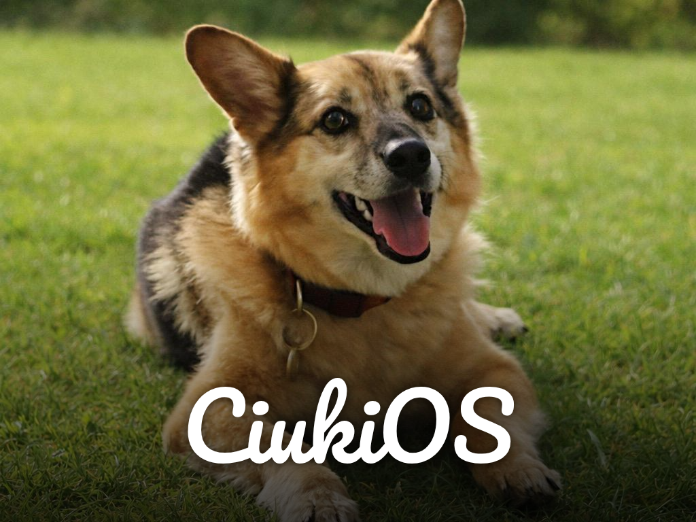
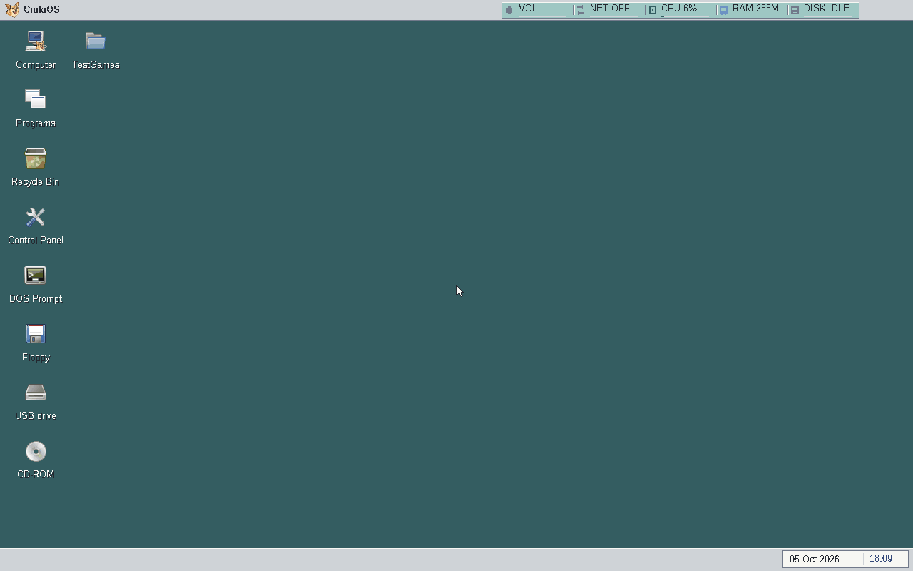
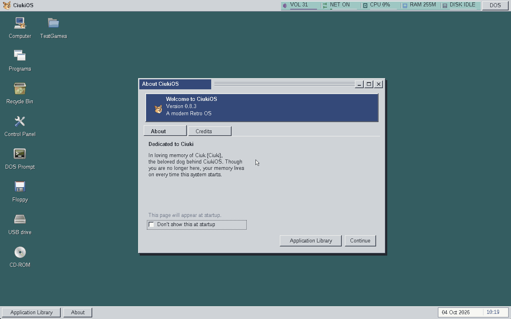
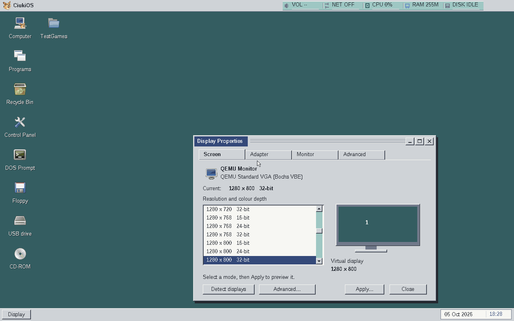
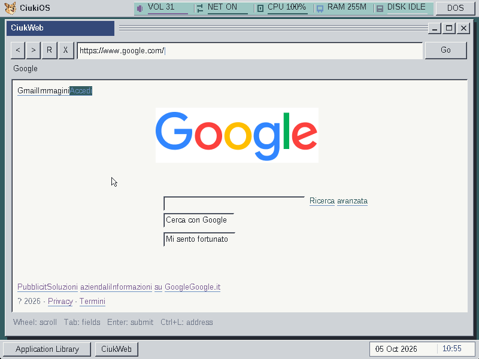
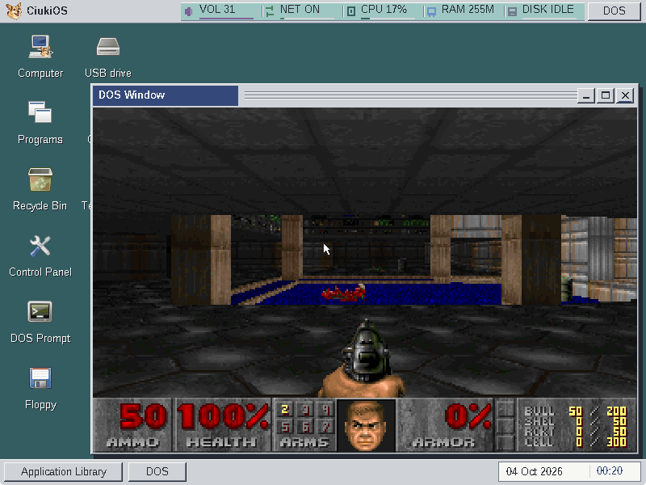

# CiukiOS

**A modern Retro OS · pre-Alpha 0.8.3**

CiukiOS is a DOS-based x86 operating system with its own CiukiDOS kernel,
graphical desktop and independent DOS windows. It is dedicated to **Ciuki**,
the dog in the boot splash. Its identity uses the owner's
[approved portrait](assets/brand/ciuki-logo.png) and the
[Tango icon family](assets/icons/README.md).



[Build and run](docs/build-and-run.md) · [Current status](docs/project-status-2026-10-04.md) · [Changelog](CHANGELOG.md) · [Roadmap](Roadmap.md)

## A look inside

| About and startup preference | Display and monitor settings |
| --- | --- |
|  |  |

| Ciuki Web | A DOS game in its own window |
| --- | --- |
|  |  |

These are actual Linux QEMU captures. [Capture details and validation limits](docs/screenshots/0.8.3/README.md).

## What it includes

- **Desktop:** Files with long FAT16 names, CiukNote, CiukPaint, Recycle Bin,
  Task Manager and Control Panel. Mouse-wheel scrolling, clipped window titles
  and an About page that opens by default, with separate credits and a saved
  “Don't show this at startup” preference. Active titles repaint when focus
  returns to a window.
- **DOS windows:** separate V86 machines with virtual VGA, input and sound,
  managed by Jemm, CVSESSION and HDPMI. QEMU runs on the development computer;
  CiukiOS itself does not run QEMU.
- **Display:** graphical mode confirmation and rollback, adapter/driver details,
  monitor EDID when available, and a native VirtIO GPU 2D presenter. ATI Rage
  128/Radeon R100–R200 and NVIDIA TNT/GeForce through 4 have limited base-display
  backends; physical cards remain unqualified.
- **Network:** automatic startup behind a detected packet driver, IPv4/DHCP,
  FTP and a cooperative HTTP browser with bounded streaming and redirects. Its
  basic HTML view supports headings, links, tables, GET forms, inline color and
  bold text. PNG, GIF and baseline JPEG images are decoded into XMS-backed
  browser storage. A bounded TLS 1.2 worker, CSS subset and mQuickJS-based
  JavaScript/DOM subset are implemented; end-to-end browser runtime checks are
  pending. CiukWeb is not a full browser or Internet Explorer equivalent.
  Adam7 PNG and progressive JPEG are unsupported, and animated GIF displays
  its first frame.
- **Development:** native C/OpenWatcom `.APP` modules, DOS/4GW and a TinyGL
  software library. General Win32 applications are not supported.

## Run it

Build and launch the full HDD image on Linux:

```bash
bash scripts/build_run_full.sh
```

For native VirtIO presentation through the host GL backend, after building:

```bash
QEMU_VIDEO_DEVICE=virtio-gl bash scripts/qemu_run_full.sh --no-build
```

Builds and QEMU run sequentially with host memory caps. See the
[requirements and safe workflow](docs/build-and-run.md). Commercial game data
is optional local test material and is excluded from releases.

The full build also produces a [portable Windows ZIP](docs/windows-portable-release.md).
The local push hook publishes a dated GitHub prerelease; no GitHub Actions
are used. ZIP integrity is checked on Linux; the launcher remains untested
on Windows. VirtIO presentation does not turn DOS Doom's software renderer
into an accelerated 3D renderer.

## Project and license

CiukiOS code is [GNU GPLv2](LICENSE). Bundled components retain their own
notices. The approved Ciuki portrait is a separate project asset, not part
of Tango's Public Domain artwork. See [current milestones](docs/current-milestones.md)
for evidence and remaining compatibility work. [Support the project](DONATIONS.md).
