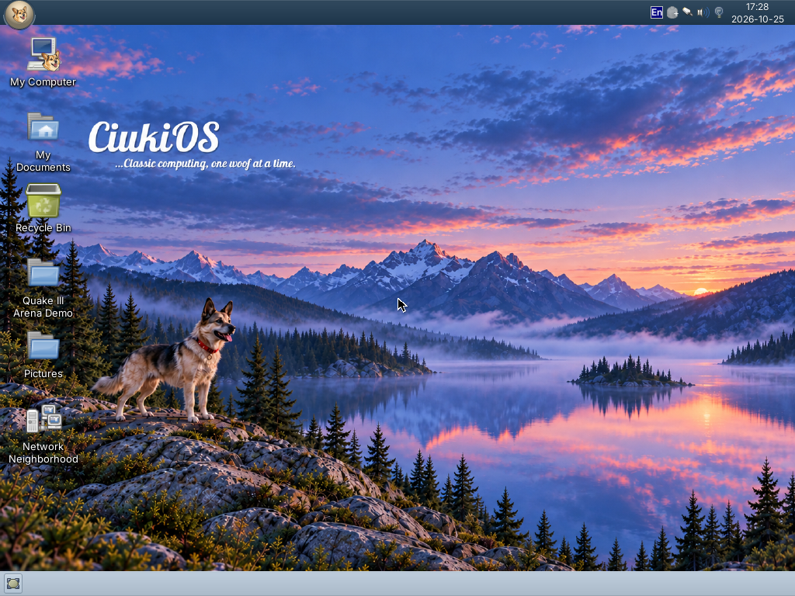
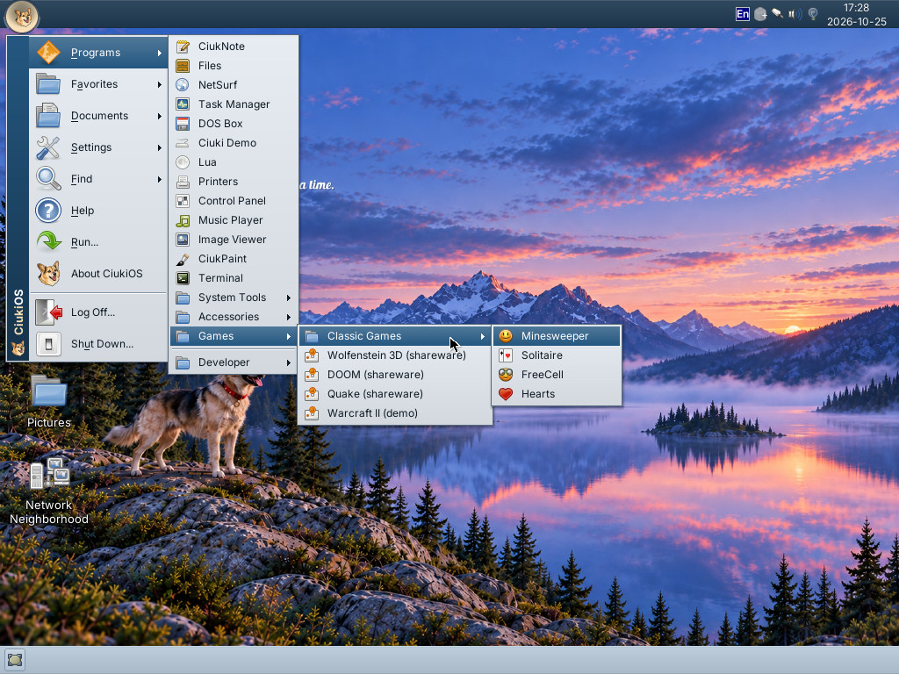
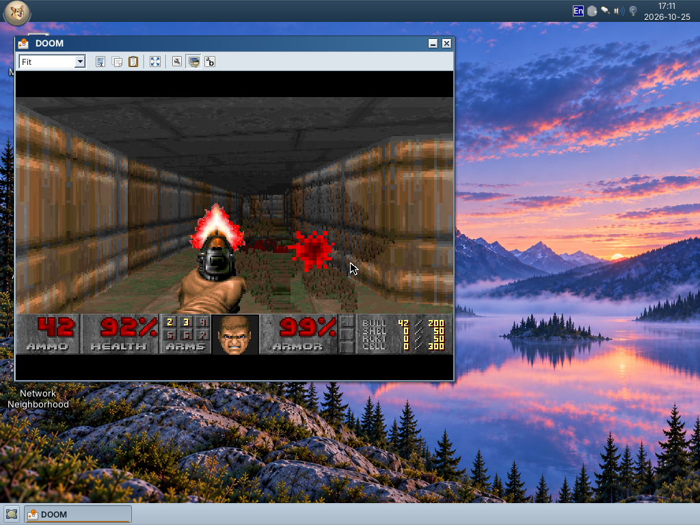
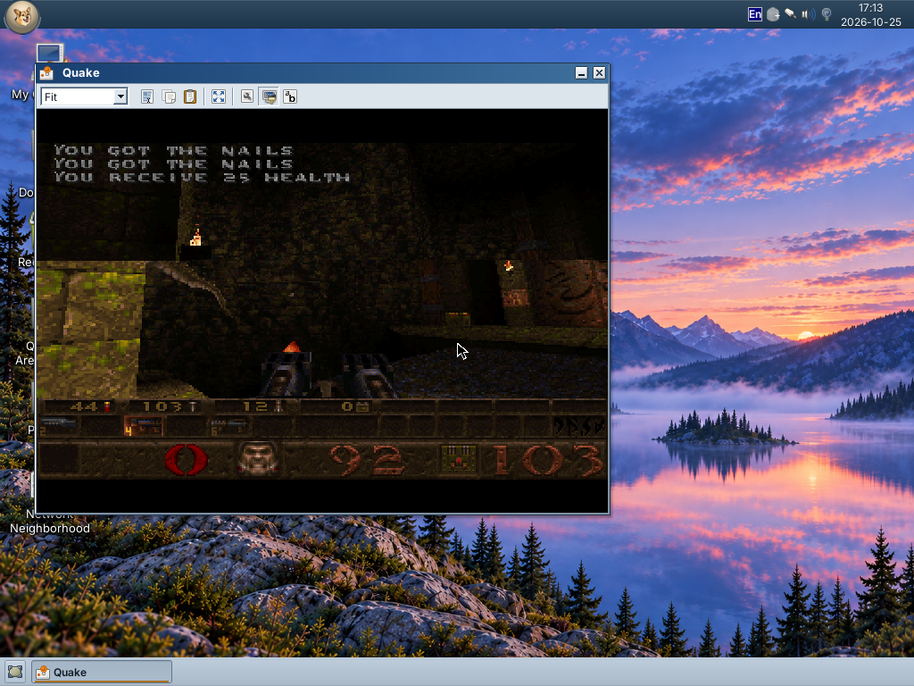
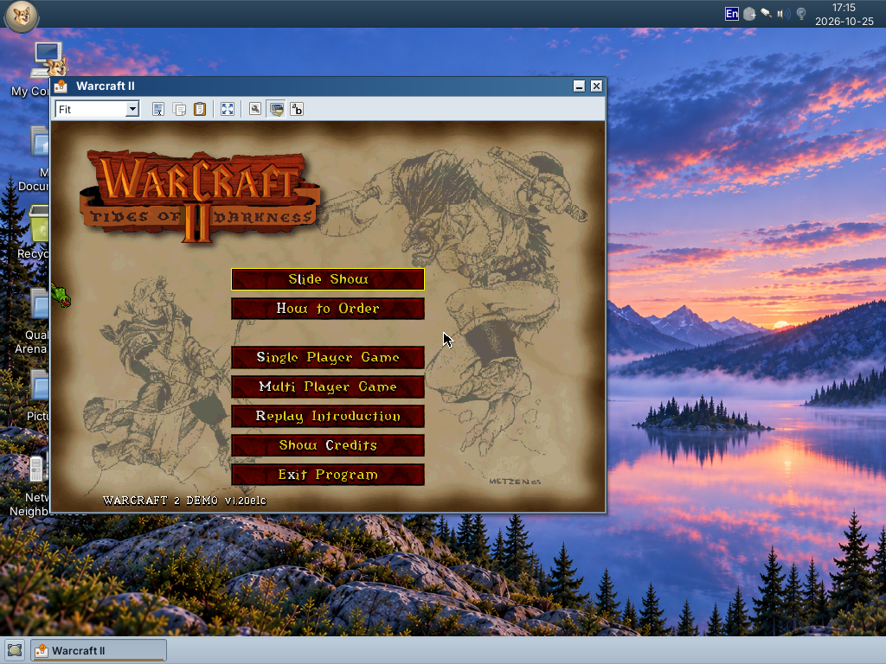
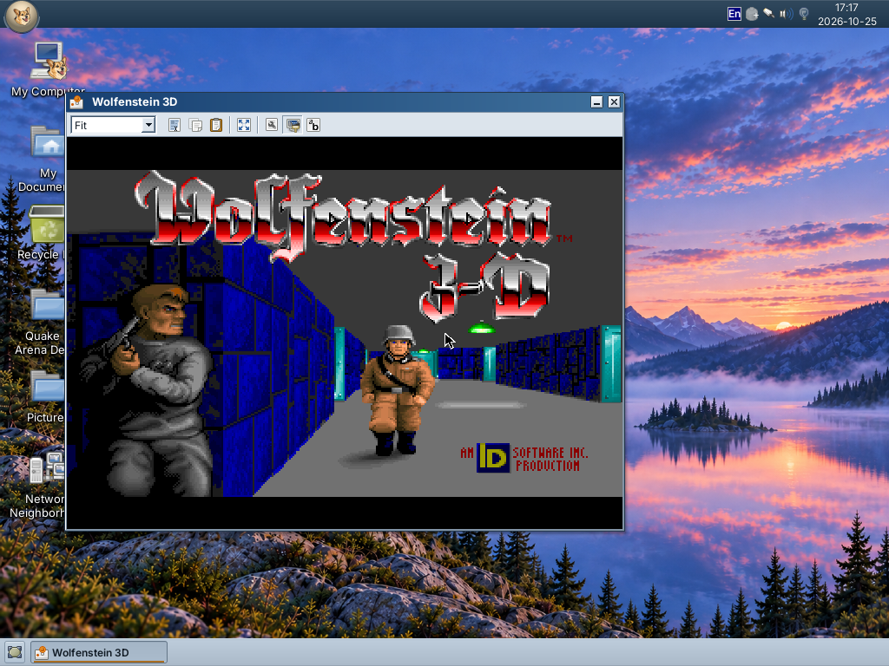
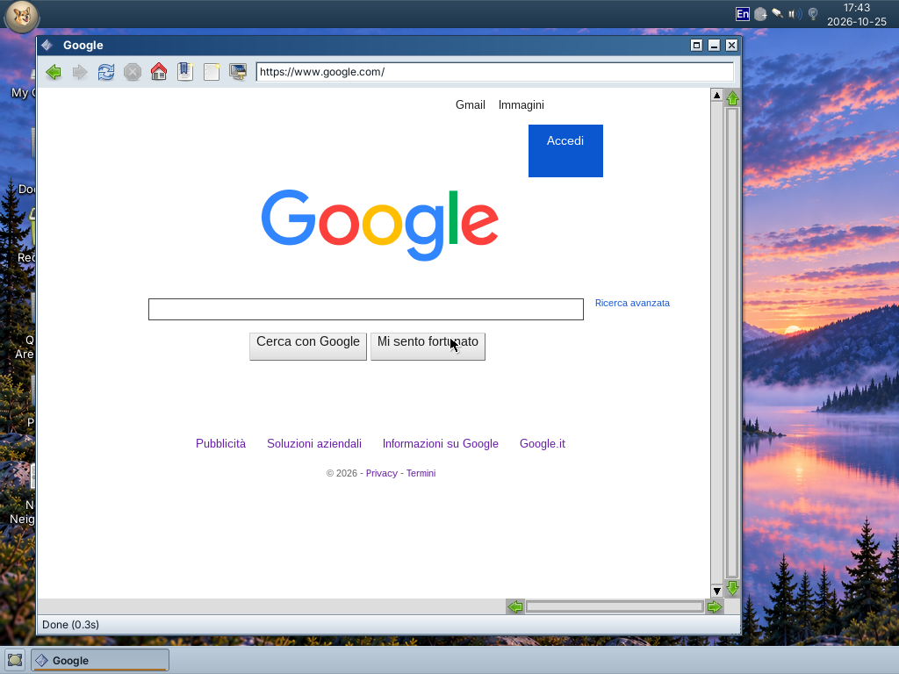
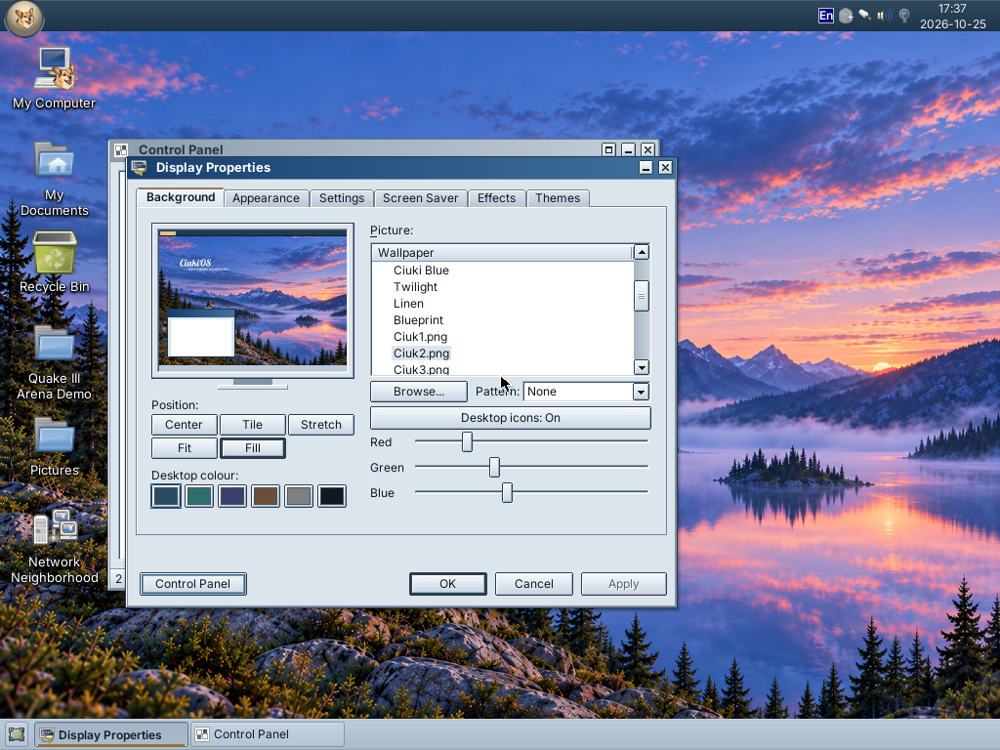
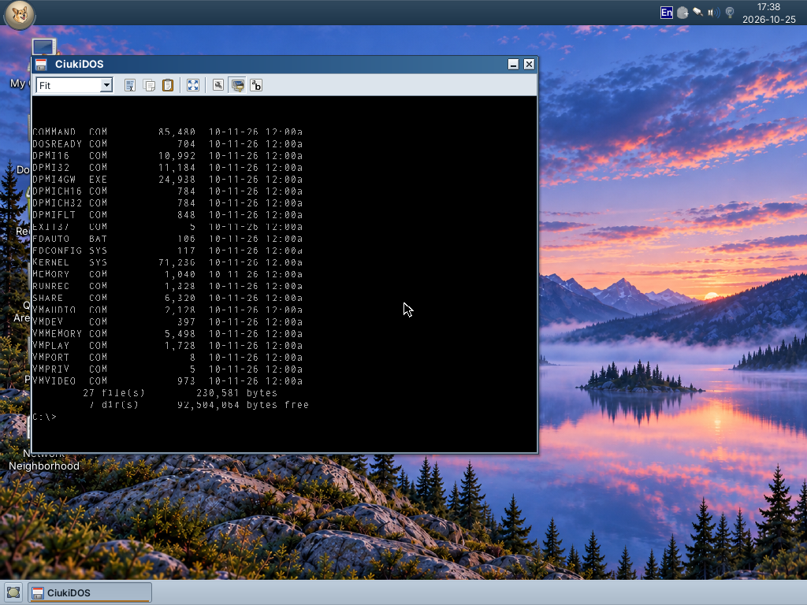

# CiukiOS

**Classic computing, one woof at a time.**

An open-source operating system for playing the games of the 1990s on the
computers of the 1990s. Dedicated to **Ciuki**, the dog in the boot splash.
Released under the [GNU GPLv2](LICENSE).

<table>
<tr>
<td><a href="docs/screenshots/1.0.1-alpha/01-desktop.png"></a><br><sub>Desktop</sub></td>
<td><a href="docs/screenshots/1.0.1-alpha/02-start-menu-classic-games.png"></a><br><sub>Start menu, Classic Games</sub></td>
<td><a href="docs/screenshots/1.0.1-alpha/03-doom.png"></a><br><sub>DOOM in a window</sub></td>
</tr>
<tr>
<td><a href="docs/screenshots/1.0.1-alpha/04-quake.png"></a><br><sub>Quake</sub></td>
<td><a href="docs/screenshots/1.0.1-alpha/05-warcraft-ii.png"></a><br><sub>Warcraft II demo (VESA)</sub></td>
<td><a href="docs/screenshots/1.0.1-alpha/06-wolfenstein-3d.png"></a><br><sub>Wolfenstein 3-D</sub></td>
</tr>
<tr>
<td><a href="docs/screenshots/1.0.1-alpha/07-netsurf-google.png"></a><br><sub>NetSurf browser</sub></td>
<td><a href="docs/screenshots/1.0.1-alpha/08-control-panel.png"></a><br><sub>Control Panel</sub></td>
<td><a href="docs/screenshots/1.0.1-alpha/10-dos-box.png"></a><br><sub>DOS Box</sub></td>
</tr>
</table>

QEMU captures of the 1.0.1 alpha ([details](docs/screenshots/1.0.1-alpha/README.md)).

## Highlights

**Games and DOS**
- DOS games in a window or full screen, with Sound Blaster 16 and AdLib/OPL3
  sound, DPMI and XMS/EMS, on a unified DOS kernel (a FreeDOS fork).
- DOOM, Wolfenstein 3-D and Quake shareware and the Warcraft II demo are
  pre-installed (Programs > Games); VESA modes work in the DOS window on any
  video card.
- Virtual NE2000 and IPX for DOS LAN play (host-tested).

**Desktop**
- A Windows 98-class desktop: Start menu, taskbar, tray, Control Panel, Files,
  Task Manager, Terminal, Registry Editor, CiukNote, WordPad, CiukPaint, Music
  Player, Image Viewer, Calculator, Classic Games (Solitaire, FreeCell, Hearts,
  Minesweeper), CiukIDE with a C compiler.
- Tango icons, FreeType fonts, themes and wallpapers.

**Windows programs**
- A Win32 API subset (PE loader, kernel32, user32, gdi32, DirectDraw,
  DirectSound) under development; no original Windows game has run yet.

**Internet**
- TCP/IP with DHCP and DNS (lwIP), HTTPS (BearSSL) and the NetSurf browser.

**Hardware**
- One image for late-1990s and early-2000s PCs, desktops and laptops alike:
  ATA with UDMA, FAT32, PS/2 and USB input, USB sticks, CD-ROM, AC'97 and other
  audio chips, several network cards. Hardware qualification is not finished.

More detail, the plan and the evidence behind each item:
[Overview](docs/overview.md) and [release notes](docs/release-notes-1.0-beta.md).

## Status

**1.0.1 beta** on `main` (unreleased): kernel-enforced user accounts, expanded
OpenGL and LAN support, DOS game and sound improvements, and Setup CD account
provisioning. Publication requires acceptance and self-test qualification of the
release image; hardware qualification continues ([Changelog](CHANGELOG.md)). The frozen
0.8 line lives on the branch
[`legacy-0.8`](https://github.com/PeronSlayer/CiukiOS/tree/legacy-0.8).

## Try it

```bash
make build-full        # kernel build/f0/VMM.ELF + image build/f0/ciukios.img
make test-host         # host unit tests
make qemu-run-full     # boot the image in QEMU
```

You need clang, ld.lld, nasm, mkfs.fat, mtools and qemu-system-i386. Full
instructions, including writing the image to a real machine:
[Build and run](docs/build-and-run.md).

## Links

- [Build and run](docs/build-and-run.md)
- [Desktop guide](docs/desktop.md)
- [Developer guide](docs/developer-guide.md) and [SDK](docs/sdk.md)
- [Credits and licences](docs/credits.md)
- [Changelog](CHANGELOG.md) and [Roadmap](Roadmap.md)
- [Overview and plan](docs/overview.md)
- [Design contracts](docs/README.md)
- [Development diary](dev_diary/README.md) (Italian)
- [Support the project](DONATIONS.md)

Developed by its owner with AI agents; see [AGENTS.md](AGENTS.md).
