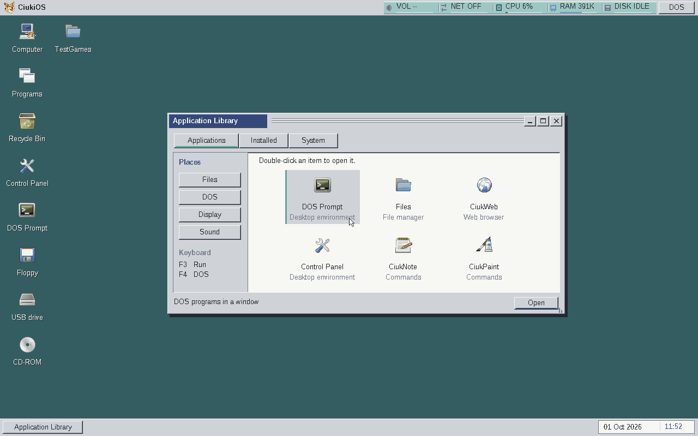
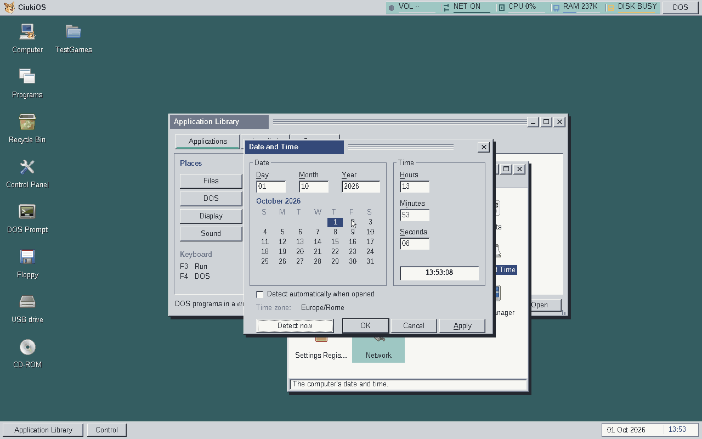

# Taskbar clock and network time zone — QEMU, 1 October 2026

The taskbar presents the date and time together. Right-clicking the clock
opens the Date and Time applet.

The focused [report](report.json) records a passing run on one 128 MiB QEMU
VM: DHCP, a public-IP time-zone lookup, RTC update, persistence of the
automatic option, and another lookup when the panel is reopened. The
service returned `Europe/Rome` in this run. The screenshots are unedited
captures of that QEMU session; they are not physical-PC evidence.

The full-image headless smoke also passed with default outbound QEMU user
NAT and the updated kernel-handoff/desktop-ready markers. The minimal
floppy profile is retired from ongoing main-branch work.
