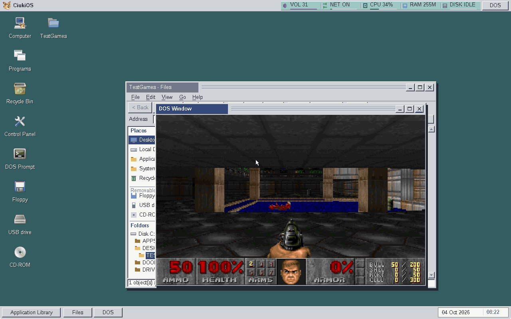
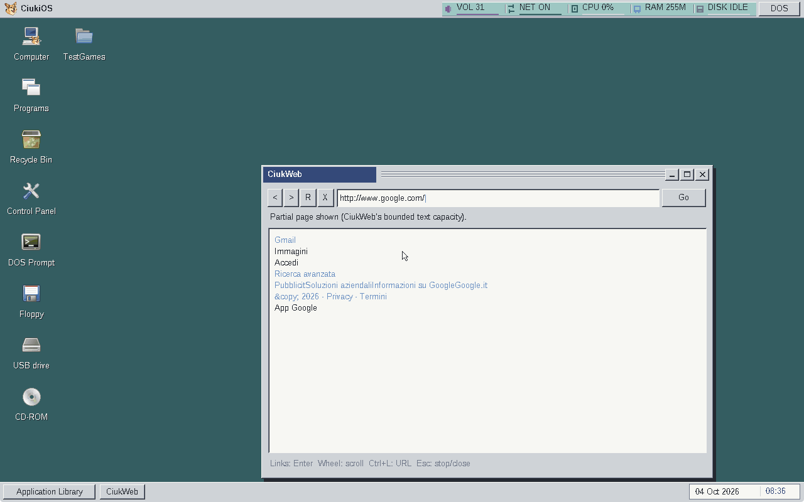
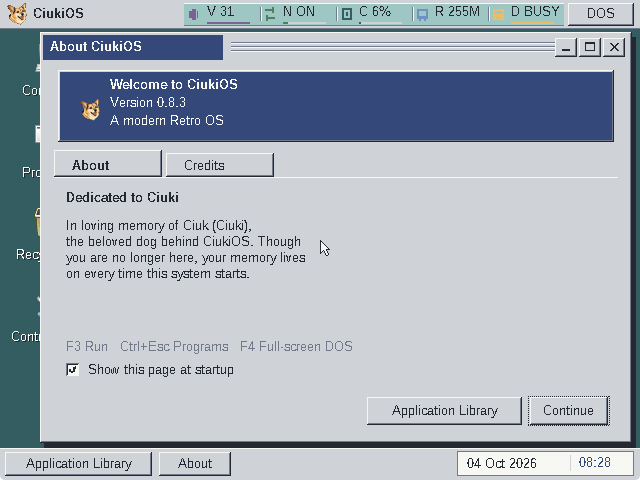
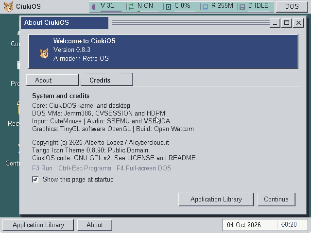

# CiukiOS 0.8.3 post-release fixes

The owner reported confusing About text, a permanent guest-only freeze when
starting Doom and a memory-limit error at `http://google.com/`. The original
user image and log were preserved before rebuilding. These results supersede
the earlier release qualification for those three defects.

## Permanent guest freeze

Browser traffic followed by a display mode preview/rollback and Files→Doom
reproduced the freeze twice. Captured PCs stayed in Crynwr's NE2000 interrupt
handler, before it could clear the network interrupt. The guest driver masked
IRQ11 and sent an early EOI, but Jemm changed only the virtual interrupt mask;
the physical level IRQ could immediately retrigger.

The corrected monitor preserves a real ISR's temporary physical self-mask and
prevents VM switches while it owns that mask. Physical level IRQs use Jemm's
normal reflection instead of receiving a premature monitor EOI. See the
[source analysis and primary references](../2026-10-04-network-irq-freeze.md).

With the old browser deliberately retained, Doom reached a new game and turned;
four physical mask operations were counted and no mask remained held. That
diagnostic run's 150 ms quit keys did not produce an exit marker, so it is not
recorded as a complete gameplay/exit pass.

The integrated image passed Google HTTP→display preview/rollback→Files→Doom,
new game, turning, quit dialog and normal exit using 250 ms quit keys. About
reopened on the desktop. Both physical PIC ISRs were clear after exit. Startup
still took about 27 seconds to reach `ST_Init`; this fix removes the permanent
stall and does not claim instant startup or zero visual stutter.

## HTTP and About

The actual Google request followed an HTTP redirect and received HTTP 200:
88,229 decoded source bytes became 2,626 retained bytes after script/style/comment
filtering. The browser shows a partial-page notice when content or a tag exceeds
its bounds; forms, JavaScript, CSS and HTTPS remain unsupported. The complete
browser module needs 63,728 bytes, below its 65,536-byte segment limit.

The production parser's host harness passed 35 assertions under AddressSanitizer
and UndefinedBehaviorSanitizer, including bytewise packet splits, a 65 KiB script
before visible content and malformed framing. A final guest check after adding
the download limits again followed the Google redirect and rendered HTTP 200
(88,305 source bytes, 2,626 retained). See the
[HTTP design and validation](../2026-10-04-web-large-pages.md).

About separates the dedication from technical credits. The compact layout
and startup checkbox were checked visually; uncheck, close and reopen retained
the preference. Enter still activates Continue by default. See the
[layout decision](../2026-10-04-about-layout.md).

## Scope and reproducibility

[Results](results.json) include the failing baseline and both corrected runs.
The Linux profile used one KVM vCPU, 256 MiB guest RAM and VirtIO GPU with SDL/GL.
QEMU was limited to 768 MiB host memory, no swap, 200% CPU and a finite timeout.
Builds and VMs ran sequentially. The full build used the workstation's 3 GiB
memory/1 GiB swap cap and one compiler job. No host crash occurred.

Inputs in this report were sent through the QEMU monitor. These runs do not
requalify physical input, real ATI/NVIDIA cards or Windows execution. Commercial
Doom data remains local and is excluded from the release package.
